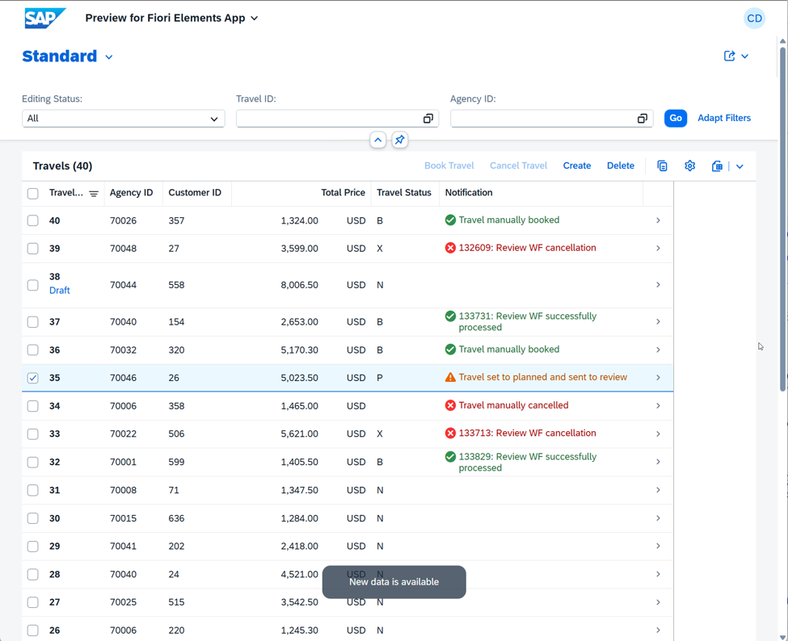
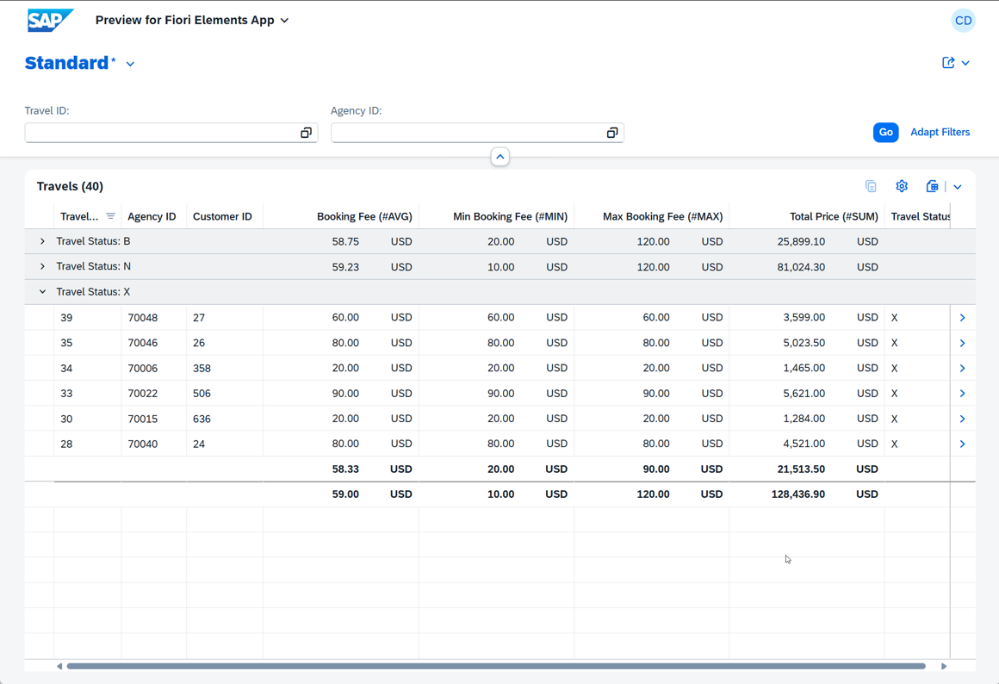
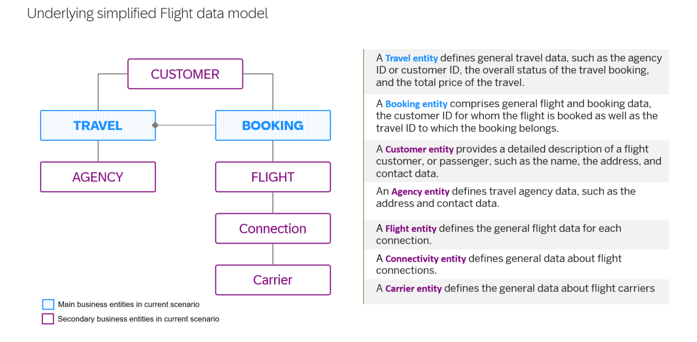

[Home - Workshops about the ABAP RESTful Application Programming Model (RAP)](https://github.com/SAP-samples/abap-platform-rap-workshops/blob/main/README.md)

# RAP200 – Explore ABAP Cloud Features in a Guided Scenario (Focus: RAP)

## Description

This repository contains the material for the hands-on session **RAP200 – Explore ABAP Cloud Features in a Guided Scenario (Focus: RAP)**. 

This hands-on workshop allows developers to explore various ABAP Cloud features, especially within the ABAP RESTful Application Programming Model (RAP), through a guided scenario: 
- ADT wizard "_From Scratch OData UI Service_" to build RAP service, with and without AI support from scratch - *_Focus on Plain wizard_
- Collaborative draft, enabling multiple users to work on the same RAP business object instance simultaneously
- Event-driven RAP side effects, allowing specific fields to be updated without reloading the entire data whenever a defined business event is raised
- Use of the Background processing framework (bgPF) to asynchronously trigger an external process within a RAP BO
- Read-only RAP Analytical table to provide a data visualization in SAP Fiori, supporting set of structured data and multiple aggregation options

## Level
🧑‍🎓 Intermediate. 

## Table of Content

- [Requirements for attending this workshop](#requirements-for-attending-this-workshop)
- [Overview](#overview)
- [Exercises](#exercises)
- [Solution Package](#solution-package)
- [Known Issues](#known-issues)
- [How to obtain support](#how-to-obtain-support)
- [Further Information](#further-information)

## Requirements for attending this workshop
[^Top of page](#)

> To complete the practical exercises in this workshop, you need:
> - An SAP BTP ABAP Environment system (e.g. SAP BTP Trial), **or** access to an SAP S/4HANA Cloud Public Edition system
> - Latest ABAP Development Tools (ADT) Plugin for  Eclipse
> - Basic knowledge of ABAP and the ABAP RESTful Application Programming Model (RAP) - see ([RAP100 – Build Fiori Apps with the ABAP RESTful Application Programming Model](https://github.com/SAP-samples/abap-platform-rap100))

  
🔵 Click to expand!

  The technical requirements to follow the exercises in this repository are:
  1. [Install the latest ABAP Development Tools (ADT) for Eclipse](https://developers.sap.com/tutorials/abap-install-adt.html)
  2. Only for **self-paced mode**:    
     [Create an SAP BTP ABAP Environment Trial User](https://developers.sap.com/tutorials/abap-environment-trial-onboarding.html) or use an on-premise system
     
     >> ⚠ **Regarding SAP-led events or workshops** ⚠️     
     >> → A dedicated system will be provided for SAP-led events.   
     >> → Access details will be shared by the instructors at the beginning of the session.
     

## Overview
[^Top of page](#)

> In this hands-on workshop, you will build and enhance a Travel Processing application using the ABAP RESTful Application Programming Model (RAP). You will generate a transactional UI service, enhance it with business logic, add collaborative draft handling, implement event-driven side effects, and create a read-only analytical table.

  
🔵 Click to expand!

  In this workshop, you will:
  - Generate a transactional OData-based UI service using the RAP Generator
  - Enhance the RAP Business Object with determinations, actions, and dynamic feature control
  - Add collaborative draft handling to the Travel application
  - Implement event-driven side effects
  - Create a read-only RAP Analytical Table for reporting

  The RAP Business Object consists of two entities:
  - **Travel** (root entity)
  - **Booking** (child entity)

<!--     
  <table border="1">
    <thead>
      <tr>
        <th>result of Blocks A + B: Transactional Travel Processing App</th>
        <th>Result of Blocks A + C: Read-only Travel Reporting App</th>
      </tr>
    </thead>
    <tbody>
      <tr>
        <td></td>
        <th> </th>
      </tr>
    </tbody>
  </table>
-->

🏁 **Resulting apps:** 

  <table border="1">
    <thead>
      <tr>
        <td><b>Transactional Travel Processing App (Exercise Blocks A + B)</b></th>
        <td></th>
      </tr>
    </thead>
    <tbody>
      <tr>
        <td><b>Read-only Travel Reporting App (Exercise Blocks A + C)</b></td>
        <th> </th>
      </tr>
    </tbody>
  </table>

 

🗃️ **Underlying simplified Flight data model**

<table border="1">
    <thead>
      <tr>
        <td><b>Underlying simplified Flight data model</b></th>
        <td></th>
      </tr>
    </thead>
  </table>

## Exercises
[^Top of page](#)

Follow the step-by-step instructions provided in the different exercises to build and enhance an application to process  _Travel_ record using the ABAP RESTful Application Programming Model (RAP).

<!--
| Exercises | -- |
| ------------- | -- |
| [Getting Started](exercises/ex0/README.md) | -- |
| [Exercise 1: Generate the Transactional UI Service](exercises/ex01/README.md) | -- |
| [Exercise 2: Basic Adaptations of the Generated UI Service](exercises/ex02/README.md) | -- |
| [Exercise 3: Add Collaborative Draft](exercises/ex03/README.md) | -- |
| [Exercise 4: Add Event-Driven Side Effects](exercises/ex04/README.md) | -- |
| [Exercise 5: Developing Read-Only RAP Analytical Tables](exercises/ex05/README.md) | -- |
| [Exercise 6: Using the BackgroungdProcessing Framework (bgPF)](exercises/ex06/README.md) | -- |

-->

#### Exercise Block A:

This exercise block provides the transactional UI service for the _Travel_ BO for the _Manage Travel_ app, which is further enhanced in the exercise blocks B and C.

| Exercises | -- |
| ------------- | -- |
| [Getting Started](exercises/ex0/README.md) | -- |
| [Exercise 1: Generate the Transactional UI Service](exercises/ex01/README.md) | -- |

#### Exercise Block B:

This exercise block enhances the transactional capabilities of the _Manage Travel_ app built in the exercise block A.

 💡**Prerequisites**: Completion of Exercise Block A

| Exercises | -- |
| ------------- | -- |
| [Exercise 2: Basic Adaptations of the Generated UI Service](exercises/ex02/README.md) | -- |
| [Exercise 3: Add Collaborative Draft](exercises/ex03/README.md) | -- |
| [Exercise 4: Add Event-Driven Side Effects](exercises/ex04/README.md) | -- |
| [Exercise 5: Using the Background Processing Framework (bgPF)](exercises/ex05/README.md) | -- |

#### Exercise Block C:

In this exercise block, you build a new consumption app with basic analytical capabilities for a read-only _Travel_ app, based on the _Travel_ app from exercise block A.

 💡**Prerequisites**: Completion of Exercise Block A

| Exercises | -- |
| ------------- | -- |
| [Exercise 6: Developing Read-Only RAP Analytical Tables](exercises/ex06/README.md) | -- |

## Solution Package
[^Top of page](#)

> You can import the solution package **`ZRAP200_SOL`** into the following systems:
> - SAP BTP ABAP Environment
> - SAP S/4HANA Cloud Public Edition

<!--

  
🔵 Click to expand!

  Follow the instructions provided below to import the solution:

  1. Open ADT and connect to your ABAP system.
  2. Use the **abapGit** plugin to clone the solution repository.
  3. Follow the on-screen instructions to complete the import.

-->

## Known Issues
[^Top of page](#)

No known issues.

## How to obtain support
[^Top of page](#)

[Create an issue](../../issues) in this repository if you find a bug or have questions about the content.

For additional support, [ask a question in SAP Community](https://answers.sap.com/questions/ask.html).

## Further Information
[^Top of page](#)

You can find more information about RAP and related topics here:

- [ABAP RESTful Application Programming Model – Documentation](https://help.sap.com/docs/abap-cloud/abap-rap/abap-restful-application-programming-model)
- [Develop and Run a Fiori Application with SAP Business Application Studio](https://developers.sap.com/mission.sap-fiori-abap-rap100.html)
- [SAP BTP ABAP Environment Community](https://community.sap.com/topics/btp-abap-environment)

## Contributing

If you wish to contribute code, offer fixes or improvements, please send a pull request. Due to legal reasons, contributors will be asked to accept a DCO when they create the first pull request to this project. This happens in an automated fashion during the submission process. SAP uses [the standard DCO text of the Linux Foundation](https://developercertificate.org/).

## License

Copyright (c) 2026 SAP SE or an SAP affiliate company. All rights reserved. This project is licensed under the Apache Software License, version 2.0 except as noted otherwise in the [LICENSE](LICENSE) file.
