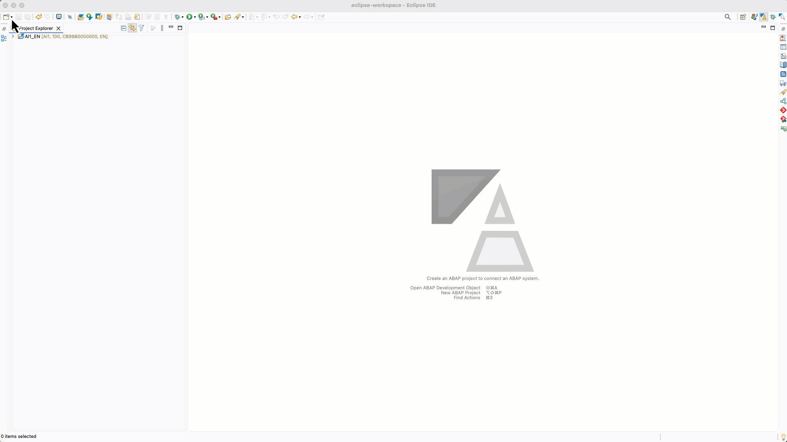
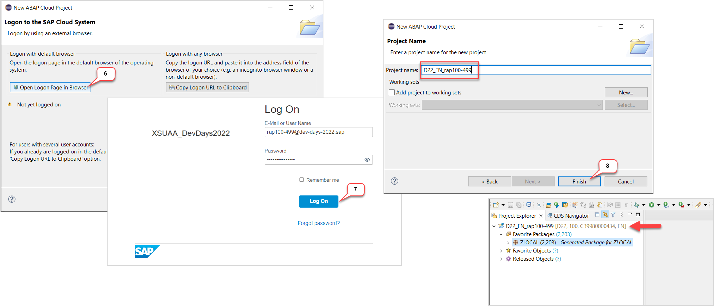
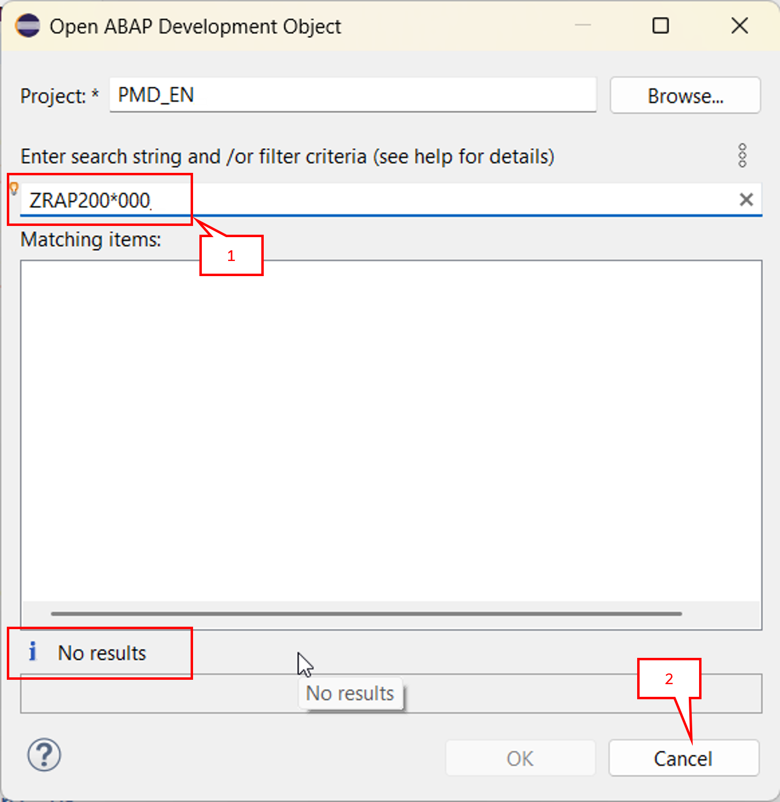

[Home - RAP200](../../README.md)

# Getting Started

## Introduction

In this exercise, you will choose a unique suffix for your development objects and verify your development environment is ready.

### Exercises

- [0.1 - Create an _ABAP Cloud Project_ in ADT](#exercise-01-create-an-abap-cloud-project-in-adt)
- [0.2 - Choose Your Unique Suffix](#exercise-02-choose-your-unique-suffix)
- [Summary & Next Exercise](#summary--next-exercise)

> ℹ️ **Reminder**: Don't forget to replace all occurrences of the placeholder **`###`** with your group ID in the exercise steps below.

## Exercise 0.1: Create an _ABAP Cloud Project_ in ADT

> Create an _**ABAP Cloud Project**_ in your ADT installation to connect it to the *SAP BTP ABAP Environment* system.

<!--

> ⚠ **Please note:** ⚠    
> If you've already created an *ABAP Cloud Project* in the ABAP Development Tools for Eclipse (ADT), then skip this section. 

> ⚠ **Participants of DSAG ABAP Development Days 2026** ⚠    
> You have received a **handout** with logon information.  
> Open the provided **System** tiny-URL in your Browser. This redirects you to the launchpad of the related *SAP BTP ABAP Environment* and requires you to logon with the provided **Username** and **Password**. Once the launchpad has loaded, copy the launchpad URL from the Browser and use it in the subsequent step when it says "Give the ABAP Service instances URL".  
-->

  
Click to expand!

   
1. Open ABAP Development Tools (ADT) in Eclipse and open the **ABAP** perspective if not yet done.

   

3. Now, create the _**ABAP Cloud Project**_ as shown below. 

  - Give the ABAP Service instances URL and click on **Next**

  - Click on **Open Logon in Browser** and enter your user credentials

  - In ADT, click on **Finish**

  

  

## Exercise 0.2: Choose Your Unique Suffix
[^Top of page](#)

> Choose a free suffix `###` that you will use throughout all exercises to make your development objects unique.

> [!IMPORTANT]
> **Info for the RAP200 Dry Run**:
> 
> Skip this step as you have received a personal suffix from the instructors.
> 
> ⚠️ Please **DO NOT USE** any other suffixes (001-340), as they are reversed for two events - Sapphire & DSAG ABAP Development Days - taking place on May 11-13, 2026!
> 

  
🔵 Click to expand!

1. Use the **Open Development Object** dialog (**Ctrl+Shift+A**) to check that your chosen suffix **`###`** is not already in use.

2. Try searching for **`ZRAP200_###`** to verify the suffix is available.

   > ℹ️ **Hint**: You might use a combination of your initials and a number (e.g., `AB1`, `XY2`) to avoid conflicts with other participants.
 
   
   
3. Note down your chosen suffix – you will use it in every exercise.

## Summary & Next Exercise
[^Top of page](#)

Now that you've...
- connect to the ABAP environment,
- chosen your unique suffix **`###`**, and
- verified your development environment is ready,

you can continue with the next exercise – **[Exercise 1: Generate the Transactional UI Service](../ex01/README.md)**

---
