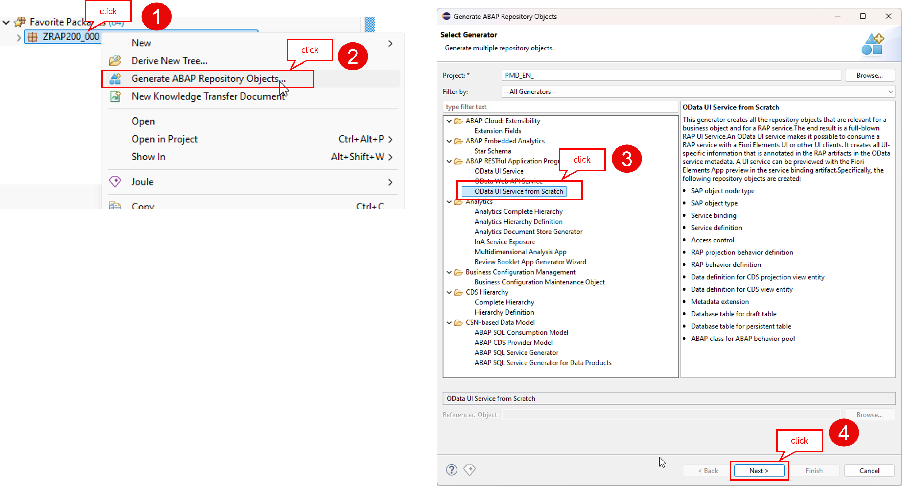
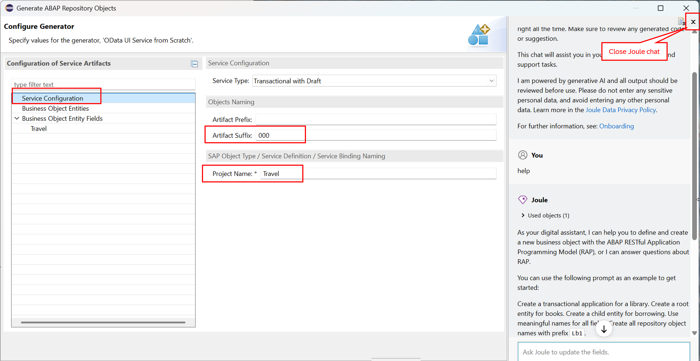
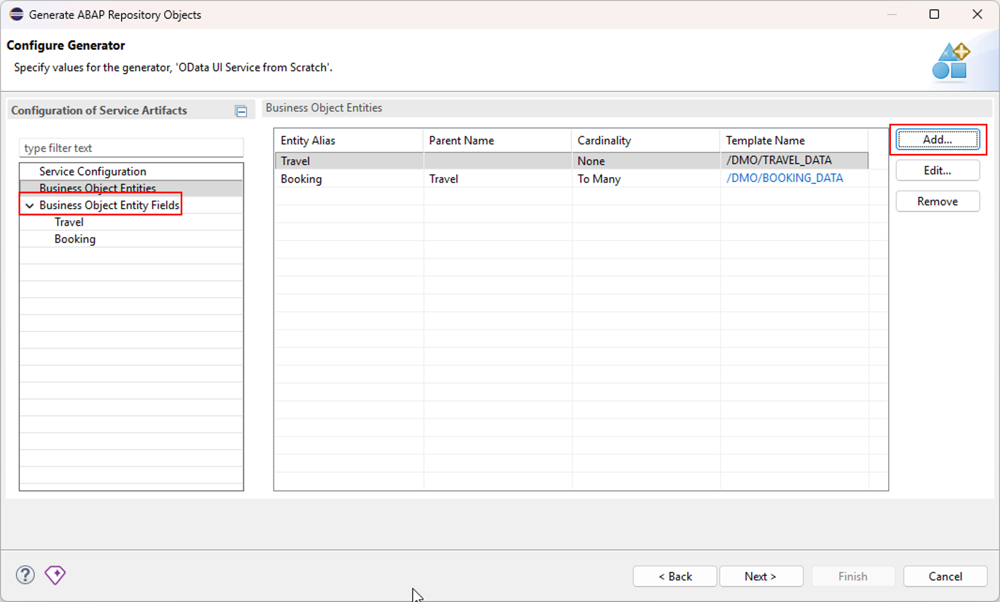
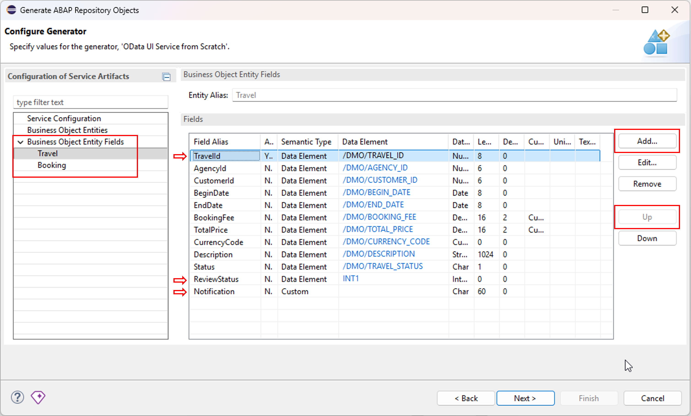
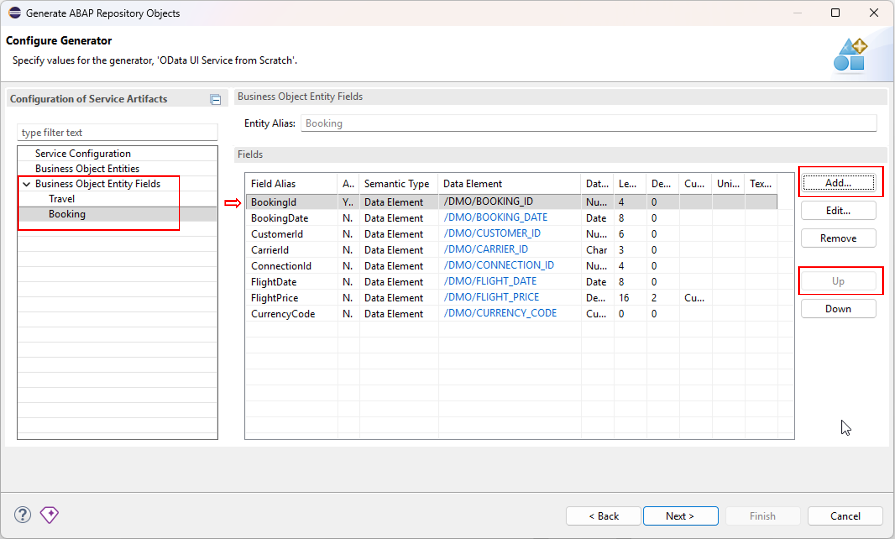
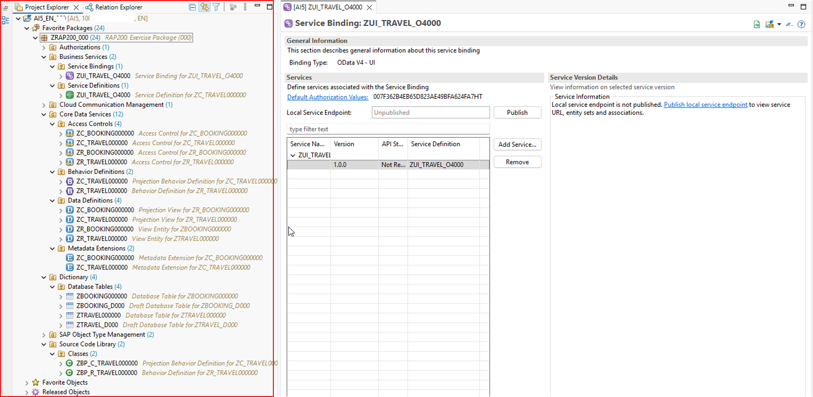
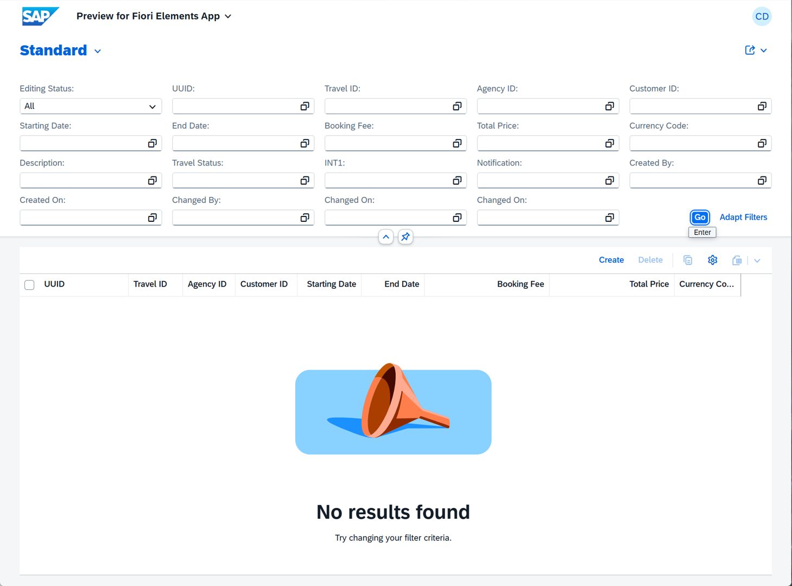
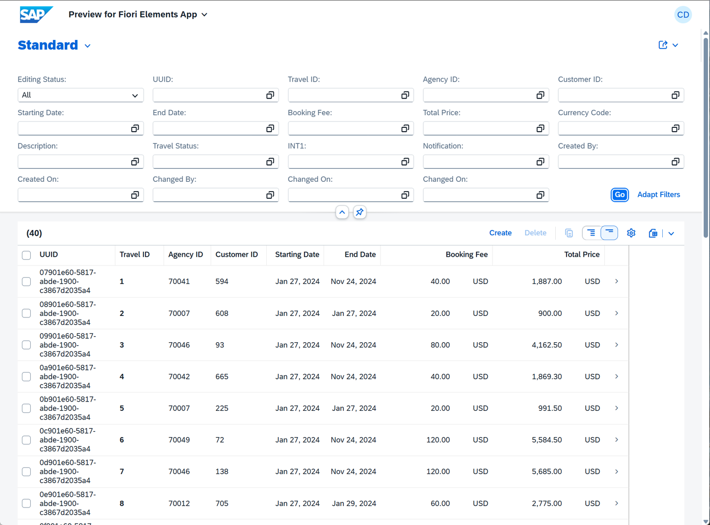

[Home - RAP200](../../README.md)

# Exercise 1: Generate the Transactional UI Service

## Introduction

In the previous exercise, you've chosen your unique suffix `###` and verified your development environment (_see [Getting Started](../ex0/README.md)_).

In this exercise, you will create your exercise package `ZRAP200_###` to group all the artefacts that you will create in the exercises and generate the transactional OData-based UI service for the Fiori elements-based _Manage Travel_ app (henceforth _Travel_ app) using the _OData UI Service From Scratch_ wizard manually. The _Travel_ app will be based on a _Travel_ BO with two entities _Travel_ (root) and _Booking_.

### Exercises

- [1.1 - Create your Exercise Package](#exercise-11-create-your-exercise-package)
- [1.2 - Generate the Transactional UI Service](#exercise-12-generate-the-transactional-ui-service)
- [1.3 - Publish and Preview the Service](#exercise-13-publish-and-preview-the-service)
- [1.4 - Create an helper interface](#exercise-14-create-an-helper-interface)
- [1.5 - Generate Demo Data](#exercise-15-generate-demo-data)
- [Summary & Next Exercise](#summary--next-exercise)

> [!TIP]
> - Always replace all occurrences of the placeholder **`###`** in the provided code snippets with your personal suffix.
> - Use the ADT function _**Find and Replace All**_ (**Ctrl+F**) to quickly replace text in the source code.
> - Use the ADT function _**Quick Fix**_ (**Ctrl+1**), aka _Quick Assist_, on an erroneous element to get help with resolving the issue.
> - Use the **Show ABAP element info** view (**F2**) to inspect an element in ADT editors.
> - Use the **ABAP Formater** function (**Ctrl+F1**) to format your source code.
>   > You may need to configure the _ABAP Formatter_ and the _DDL Formater_ if using it for the first the in a given system under the Eclipse menu **Window > Preferences** and naviagte to **ABAP Development > Source Code Editor** to configure the _**ABAP Formatter**_ and then go to **> CDS > DDL Formatter**. You can search for _"Formatter"_.
> - [Useful Keyboard Shortcuts for ABAP Development](https://help.sap.com/docs/ABAP_PLATFORM_NEW/c238d694b825421f940829321ffa326a/4ec299d16e391014adc9fffe4e204223.html?version=latest) (ADT shortcuts)

> [!NOTE]
> **About ABAP Cloud generators in ADT: _Generate ABAP Repository Objects_ Wizards**
> 
> <details>
>  <summary>Click to expand!</summary>  
>
>  <br/>
>   
>  The ABAP development tools for Eclipse (ADT) offers developers different wizards that support you in generating repository objects required for use cases like creating a transactional app, or creating integration services. Depending on the wizard you choose, you start the generation process with an already existing repository object, or completely from scratch. You can also decide whether your business object (BO) should be generated as a UI service or a Web API service.   
>  
> The **_OData UI Service from Scratch_ wizard** allows developers to can create all RAP service-related repository objects from scratch by using the OData UI Service from Scratch wizard. You don't need an already
>  existing repository object, because you can start the wizard from an empty package. The wizard allows developers to create a RAP business object by either using the wizard manually or with the aid of the Joule chat.
>  The created BOs can have one or multiple node entities.  
>  
> **Learn more:** [Generating a RAP Business Service with the _Generate ABAP Repository Objects_ Wizards](https://help.sap.com/docs/abap-cloud/abap-rap/generating-rap-business-service-with-generate-abap-repository-objects-wizard) | [Using the OData UI Service from Scratch Wizard](https://help.sap.com/docs/abap-cloud/abap-rap/using-odata-ui-service-from-scratch-wizard)
>  </details>

---

## Exercise 1.1: Create your Exercise Package
[^Top of page](#)

> Create your exercise package `ZRAP200_###` to group all artefacts that you will create in this exercise.
> 
> 💡 Remember to replace all occurences of the suffix placeholder `###` with your personal suffix in all exercise steps. 

<details>
  <summary>🔵 Click to expand!</summary>

1. In ADT, go to the **Project Explorer**, right-click on the **`ZLOCAL`**, and select **New** > **ABAP Package** from the context menu. 

2. Enter the following values:

   | Field | Value |
   |---|---|
   | Package Name | **`ZRAP200_###`** |
   | Description | **`RAP200: Exercise Package (###)`** |
   | Add to favorite packages | `☑️` Select the box  |
   | Superpackage | **`ZLOCAL`** |

4. Click **Next >**, select a transport request if required, then click **Finish** to confirm the creation.

<br/>

</details>

## Exercise 1.2: Generate the Transactional UI Service
[^Top of page](#)

> Create a new transactional OData-based UI service based on a RAP BO with two node entities _Travel_ (as root entity) and _Booking_ using the RAP Generator in your exercise package `ZRAP200_###`. You will use the structures `/DMO/TRAVEL_DATA` and `/DMO/BOOKING_DATA` as templates for creating both BO node entities.

<details>
  <summary>🔵 Click to expand!</summary>

1. In ADT, right-click on your exercise package **`ZRAP200_###`**, select **Generate ABAP Repository Objects...** from the context menu, select **OData UI Service from Scratch**, and press **Next**.

    

   Now go ahead and configure the _Travel_ BO in the creation dialog. 

2. Enter the following values on the **Service Configuration** tab:

   | Field | Value |
   |---|---|
   | Artefact Suffix | **`###`** |
   | Project Name | **`Travel`** |

    

3. Go to the **Business Object Entities** tab and **add the BO entities** **`Travel`** and **`Booking`** by pressing the **Add...** button:

   - **Add** the BO root entity **`Travel`** and configure it as follows:
       
     | Field | Value |
     |---|---|
     | Entity Alias* | **`Travel`** |
     | Template | **`/DMO/TRAVEL_DATA`** |

   - **Add** the BO child entity **`Booking`** and configure it as follows:

     | Field | Value |
     |---|---|
     | Entity Alias* | **`Booking`** |
     | Parent Name | **`Travel`** |
     | Cardinality* | **`To Many`** |
     | Template Name | **`/DMO/BOOKING_DATA`** |

    

4. Now, go to the **Business Object Entities Fields** tab and **add new fields** to the **_Travel_** entity using the **Add...** button:
   
   - Add the semantic key field **`TravelID`** to the _Travel_ entity and  move it at the top of the field list using the **Up** button:
     
     | Field | Value |
     |---|---|
     | Field Alias* | **`TravelID`** |
     | Annotate as Semantic Key | `☑️` _Select the box_ |
     | Semantic Type | **`Data Element`** |
     | Data Element | **`/DMO/TRAVEL_ID`** |

   - Add the field **`ReviewStatus`** to the _Travel_ entity and keep it at the bottom of the field list:

     | Field | Value |
     |---|---|
     | Field Alias* | **`ReviewStatus`** |
     | Annotate as Semantic Key | _Do not select the box_ |
     | Semantic Type | **`Data Element`** |
     | Data Element | **`INT1`** |
   
   - Add the field **`Notification`** to the _Travel_ entity and keep it at bottom of the field list:

     | Field | Value |
     |---|---|
     | Field Alias* | **`Notification`** |
     | Annotate as Semantic Key | _Do not select the box_|
     | Semantic Type | **`Custom`** |
     | Data Type | **`Char`** |
     | Length | **`60`** |

    

5. Now, **add a new field** to the **_Booking_** entity on the **Business Object Entities Fields** tab using the **Add...** button:

   - Add the field **`BookingID`** to the _Booking_ entity and move it to top of the field list using the **Up** button:

     | Field | Value |
     |---|---|
     | Field Alias* | **`BookingID`** |
     | Annotate as Semantic Key | `☑️` _Select the box_ |
     | Semantic Type | **`Data Element`** |
     | Data Element | **`/DMO/BOOKING_ID`** |

    

6. Click **Next >** and review the artefacts to be generated.

   <!--  -->

7. Click **Next >**, create or choose a transport request if required, click **Next >** and confirm with **Finish** to generate all artefacts.

8. After few seconds, click **Open** in the appearing dialog to open the generated object **`ZUI_TRAVEL_O4###`** in the service binding editor.

   <!--  -->
   <!-- animated Gif of the entire step 1.2 -->

9. You can refresh (**F5**) the package in the **Project Explorer** to load all generated development objects if not yet displayed after the successful generation.

     

</details>

<!--

> [!TIP]
> Using Joule to generate the UI service: 

<details>
  <summary>🔵 Click to expand!</summary>

   1. Right-click on your ABAP package **`ZRAP200_###`** and select **Generate ABAP Repository Objects...** from the context menu.
      
      Under ABAP RESTFul Application Programming Model select the entry **OData UI Service from Scratch** in the wizard and click **Next >**.
      
      Maintain your package name **`ZRAP120_###`** and click **Next >**.                  

   2. Please copy and paste the prompt provided below in the chat, and press **Enter**.
   
      Ensure to replace **`###`** with your personal suffix.
      
      ```PROMPT
      Create a transactional application for travel management with DRAFT.
      Create the entity Travel based on the structure /DMO/TRAVEL_DATA. 
      The second entity is Booking based on /DMO/BOOKING_DATA.
      The generated objects should end with  suffix “###”.
      ```

 3. Joule will recommend the Business Object entities _Travel_ and _Booking_ along with their respective fields. 
   
      Press **Accept** to allow Joule to update the service configuration in the dialog on the right.
 
      > ℹ️ NOTE: The names of the artifacts, database fields, and other elements in your project may differ from those shown in this tutorial, as they are generated by GenAI
       
   4. You can add new fields to the entities either by using the wizard or the chat. We will use this feature and add four fields called **`TravelId`**, **`ReviewStatus`**, **`Notification`** and **`BookingId`**.   
   
      To do so, copy and paste the prompt provided below, and press **Enter**
      
      ```PROMPT
         Add  TravelId field as semantic key for entity Travel, use /DMO/TRAVEL_ID as data element. 
         Add  ReviewStatus field for entity Travel, use INT1 as data element.
         Add  Notification field for entity Travel, use datatype CHAR and length 60. 
         Add  BookingId field as semantic key for entity Booking, use /DMO/BOOKING_ID as data element.  
      ```

   5. Joule will suggest adding the fields **`TravelId`**, **`ReviewStatus`**, **`Notification`** and **`BookingId`**.. 
   
      Press **Accept** to allow Joule to update the service configuration in the dialog on the right.

      Please review the updated service configuration and make the following manual adjustment if needed.
   
</detail>

-->

## Exercise 1.3: Publish and Preview the Service
[^Top of page](#)

> Publish the service endpoint of your service binding `ZUI_TRAVEL_O4###` and preview the generated Fiori Elements app.

<details>
  <summary>🔵 Click to expand!</summary>

1. Go to your **Service Binding** **`ZUI_TRAVEL_O4###`** or open it by douoble-clicking on it in the **Project Explorer**.

2. Click **Publish** to publish the local service endpoint to view service URL, entity sets, and associations.

   <!--  -->

3. Select the leading **`Travel`** entity and start the **Fiori Elements App Preview** by pressing the **Preview...** button or double-clicking it.  

4. Press **Go** to load the data in the app.

   > ℹ️ The list should be empty at this point since no demo data has been generated yet.

    

</details>


## Exercise 1.4: Create an helper interface 
[^Top of page](#)

> First create the interface `ZRAP200_IF_TRAVEL###` as helper interface to provide reuse constants and functionalities centrally.

<details>
  <summary>🔵 Click to expand!</summary>
  
1. Right-click on your package **`ZRAP200_###`** and select **New** > **ABAP Interface**.

2. Enter the following values:

   | Field | Value |
   |---|---|
   | Name | **`ZRAP200_IF_TRAVEL###`** |
   | Description | **`Constants and other stuff`** |

3. Replace the complete class definition with the source code provided below, and replace all occurrences of the placeholder **`###`** with your chosen suffix using **Ctrl+F**.

   <details>
     <summary>🟣📄 Click to expand the source code!</summary>

   ```abap
   INTERFACE zrap200_if_travel###
     PUBLIC .
     CONSTANTS:
       BEGIN OF travel_status,       "/dmo/travel_status
         new       TYPE c LENGTH 1 VALUE 'N', "New / 0
         booked    TYPE c LENGTH 1 VALUE 'B', "Booked / 1
         planned   TYPE c LENGTH 1 VALUE 'P', "Planned / 2
         cancelled TYPE c LENGTH 1 VALUE 'X', "Cancelled / 3
       END OF travel_status,
   
       BEGIN OF review_status,
         new       TYPE int1 VALUE 0, "(N) New
         cancelled TYPE int1 VALUE 1, "(C) cancelled
         planned   TYPE int1 VALUE 2, "(P) planned
         booked    TYPE int1 VALUE 3, "(B) booked
       END OF review_status,
   
       BEGIN OF review_notification,
         new       TYPE string VALUE ' ', "N/New, neutral
         cancelled TYPE string VALUE 'Review WF cancellation for', "(X)cancelled / 3:red
         planned   TYPE string VALUE 'Sent to review WF...', "(P) planned / 2:yellow
         booked    TYPE string VALUE 'Review WF successfully processed', "(B) booked / 1:green
       END OF review_notification.
   
   ENDINTERFACE.   
   ``` 

   </details>

4. Save  (**Ctrl+S**) and activate  (**Ctrl+F3**) the changes.

</details>


## Exercise 1.5: Generate Demo Data
[^Top of page](#)

> Create and execute the class **`ZRAP200_GENERATE_DEMO_DATA_###`** to generate demo data for the Travel and Booking entities.

<details>
  <summary>🔵 Click to expand!</summary>

1. Right-click on your package **`ZRAP200_###`** and select **New** > **ABAP Class**.

2. Enter the following values:

   | Field | Value |
   |---|---|
   | Name | **`ZRAP200_GENERATE_DEMO_DATA_###`** |
   | Description | **`RAP200: Generate travel and booking demo data`** |

3. Replace the complete class definition with the source code provided below, and replace all occurrences of the placeholder **`###`** with your chosen suffix using **Ctrl+F**.

   <details>
     <summary>🟣📄 Click to expand the source code!</summary>

     > 💡**Hints**:  
     > - Replace all occurences of the placeholder **`###`** with your personal suffix using _**Find and Replace All**_ function (**Ctrl+F**)  
     > - Use the **ABAP Formater** function (**Ctrl+F1**) to format your source code
     >   > You may need to configure the _ABAP Formatter_ and the _DDL Formater_ if using it for the first the in a given system under the Eclipse menu **Window > Preferences**
     >   > and naviagte to **ABAP Development > Source Code Editor** to configure the _**ABAP Formatter**_.
     >    
  
   ```abap
   CLASS zrap200_generate_demo_data_### DEFINITION
     PUBLIC
     FINAL
     CREATE PUBLIC .
     PUBLIC SECTION.
       INTERFACES if_oo_adt_classrun.
   
     PROTECTED SECTION.
     PRIVATE SECTION.    
   ENDCLASS.
    
   CLASS zrap200_generate_demo_data_### IMPLEMENTATION.
     METHOD if_oo_adt_classrun~main.
       DATA travel_data  TYPE TABLE OF ztravel###.
       DATA booking_data TYPE TABLE OF zbooking###.
    
       " delete existing entries in the active database tables
       DELETE FROM ztravel###.
       DELETE FROM zbooking###.
    
       " delete existing entries in the draft database tables
       DELETE FROM ztravel_d###.
       DELETE FROM zbooking_d###.
    
       COMMIT WORK.
    
       SELECT * FROM /dmo/travel
         INTO CORRESPONDING FIELDS OF TABLE @travel_data
         UP TO 100 ROWS.
    
       LOOP AT travel_data ASSIGNING FIELD-SYMBOL(<ls_travel>).
         <ls_travel>-uuid = xco_cp=>uuid( )->value.
         CASE <ls_travel>-status.
           WHEN 'P'.
             <ls_travel>-status = 'N'.
           WHEN 'B'.
             <ls_travel>-review_status = zrap200_if_travel###=>review_status-booked.
             <ls_travel>-notification  = 'Travel manually successfully booked'.
           WHEN 'X'.
             <ls_travel>-review_status = zrap200_if_travel###=>review_status-cancelled.
             <ls_travel>-notification  = 'Travel manually cancelled'.
         ENDCASE.
    
       ENDLOOP.
    
       " insert travel demo data
       MODIFY ztravel### FROM TABLE @travel_data.
       COMMIT WORK.
    
       SELECT * FROM /dmo/booking AS booking
                JOIN ztravel### AS z ON booking~travel_id = z~travel_id
                INTO CORRESPONDING FIELDS OF TABLE @booking_data.
    
       LOOP AT booking_data ASSIGNING FIELD-SYMBOL(<ls_booking>).
         <ls_booking>-uuid = xco_cp=>uuid( )->value.
       ENDLOOP.
    
       MODIFY zbooking### FROM TABLE @booking_data.
       COMMIT WORK.
    
       out->write(
           | ✅ [RAP200 (t:{ cl_abap_context_info=>get_system_time( ) })] Travel and booking demo data successfully inserted.| ).
     ENDMETHOD.
    
   ENDCLASS.
   ```
   
   </details>
     
4. Save  (**Ctrl+S**) and activate  (**Ctrl+F3**) the changes.

5. Execute the report as **Console App** by pressing **F9**.

   <!--   -->

6. Refresh your app in the browser and press **Go** to load the generated data.

    

</details>

## Summary & Next Exercise
[^Top of page](#)

Now that you've...
- generated a transactional UI service with two BO entities (Travel and Booking) using the RAP generator `OData UI From Scratch`,
- published the service endpoint and previewed the Fiori elements app, and
- generated demo data for the _Travel_ and _Booking_ entities,

you can continue with the next exercise – **[Exercise 2: Basic Adaptations of the Generated UI Service](../ex02/README.md)**

---
