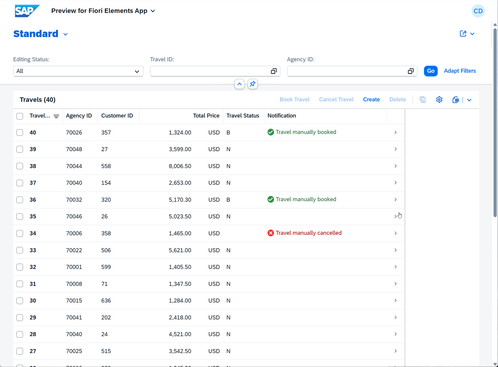

[Home - RAP200](../../README.md)

# Exercise 2: Basic Adaptations of the Generated UI Service

## Introduction

In the previous exercise, you've generated a transactional UI service with Travel and Booking entities, published it, and generated demo data (_see [Exercise 1](../ex01/README.md)_).

In this exercise, you will enhance the base _Travel_ BO behavior by adding basic behavior, including the determination `setStatusToNew`, two actions `bookTravel` and `cancelTravel`, as well as the static and dynamic feature control to the _travel_ entity. You will also adjust the UI semantics of the _Travel_ app by adjusting the metadata extensions of the _travel_ and _booking_ entity.

<!--
   - `setStatusToNew`: to set the field `Status` to _New_ (`N`) at creation time of a new _travel_ entity.
   - `bookTravel`: to set the field `Status` to _Booked_ (`B`) of a _travel_ entity.
   - `cancelTravel`: to set the field `Status` to _Cancelled_ (`X`) of a _travel_ entity.
   - Dynamic feature control: to disable the _Bookeded_ button, when a _travel_ record is set to _Cancelled_ and vice versa. Disable both buttons when the `ReviewStatus` field is _Planned_ (`P`).
   - Static feature control: to set the fields `Status`, `ReviewStatus`, and `Notification` of the _travel_ entity to read-only on the BO projection level.
-->

> [!NOTE]
> The purpose of this enhancement is to make the _Travel_ app more feature-rich to serve as foundation for following exercises. These basic capabilities are covered in the hands-on workshop [RAP100](https://github.com/SAP-samples/abap-platform-rap100/blob/main/README.md). Therefore, due to time constraints and in order to focus on new capabilities, you will update the source code of the relevant development objects by simply replacing their sourcode with the one provided. 

### Exercises

- [2.1 - Enhance the _Travel_ BO Behavior](#exercise-21-enhance-the-travel-bo-behavior)
- [2.2 - Preview the Enhanced _Travel_ App](#exercise-22-preview-the-enhanced-travel-app)
- [Summary & Next Exercise](#summary--next-exercise)

 

> [!TIP]
> 

>  
Click to expand ADT tips!
  
>  
> - Always replace all occurrences of the placeholder **`###`** in the provided code snippets with your personal suffix.
> - Use the ADT function _**Find and Replace All**_ (**Ctrl+F**) to quickly replace text in the source code.
> - Use the ADT function _**Quick Fix**_ (**Ctrl+1**), aka _Quick Assist_, on an erroneous element to get help with resolving the issue.
> - Use the **Show ABAP element info** view (**F2**) to inspect an element in ADT editors.
> - Use the **ABAP Formater** function (**Ctrl+F1**) to format your source code.
>   > You may need to configure the _ABAP Formatter_ and the _DDL Formater_ if using it for the first the in a given system under the Eclipse menu **Window > Preferences** and naviagte to **ABAP Development > Source Code Editor** to configure the _**ABAP Formatter**_ and then go to **> CDS > DDL Formatter**. You can search for _"Formatter"_.   
> - [Useful Keyboard Shortcuts for ABAP Development](https://help.sap.com/docs/ABAP_PLATFORM_NEW/c238d694b825421f940829321ffa326a/4ec299d16e391014adc9fffe4e204223.html?version=latest) (ADT shortcuts)
>
> 

---

## Exercise 2.1: Enhance the _Travel_ BO Behavior
[^Top of page](#)

> Now, enhance the generated _Travel_ app by enhancing the _Travel_ BO behavior with the determination `setStatusToNew`, two actions `bookTravel` and `cancelTravel`,
> and feature control, as well as adjusting the UI semantics of the _Travel_ app. You will replace the entire source code of the different development objects with
> the version provided in the respective source code document. 

> [!NOTE]
> For all development objects listed in the tables below, complete the following steps:  
> - Open the object in the **Project Explorer**
> - Replace its entire source code with the version provided in the respective source code document 
> - Replace all occurrences of the placeholder **`###`** with your personal suffix
> - Save  (**Ctrl+S**) and activate  (**Ctrl+F3**) the changes

<!--
   | # | Object Type | Object Name | Respective Source Code Document
   |---|---|---|---|
   | **1** | CDS Behavior **Definition** | **`ZR_TRAVEL###`** | 📄[ex02_bdef_ZR_TRAVEL.txt](sources/ex02_bdef_ZR_TRAVEL.txt)|
   | **2** | Behavior Implementation **Class** | **`ZBP_R_TRAVEL###`** | 📄[ex02_class_ZBP_R_TRAVEL###](sources/ex02_class_ZBP_R_TRAVEL.txt) |
   | **3** | CDS Behavior **Projection** | **`ZC_TRAVEL###`** | 📄[ex02_bdef_ZC_TRAVEL.txt](sources/ex02_bdef_ZC_TRAVEL.txt) |  
   | **4** | CDS Metadata **Extensions** | **`ZC_TRAVEL###`** | 📄[ex02_ddlx_ZC_TRAVEL.txt](sources/ex02_ddlx_ZC_TRAVEL.txt) |
   | **5** | CDS Metadata **Extensions** | **`ZC_BOOKING###`** | 📄[ex02_ddlx_ZC_BOOKING.txt](sources/ex02_ddlx_ZC_BOOKING.txt) |   
-->

  
🔵 Click to expand!

1. Open and enhance the base _Travel_ BO behavior definition **`ZR_TRAVEL###`** to include the determination `setStatusToNew`, the actions `bookTravel` and `cancelTravel`, and dynamic feature control for `update`, `delete`, `bookTravel`, and `cancelTravel`.

   To achieve that replace the entire source code with the version provided in the source code document below and replace all occurrences of the placeholder **`###`** with your personal suffix.

   Then save  (**Ctrl+S**) and activate  (**Ctrl+F3**) the changes.

   | Object Type | Object Name | Respective Source Code Document
   |---|---|---|
   | CDS Behavior **Definition** | **`ZR_TRAVEL###`** | 📄[ex02_bdef_ZR_TRAVEL.txt](sources/ex02_bdef_ZR_TRAVEL.txt)|

   

     
Click to expand brief explanation!

    
      
   - Determination `setStatusToNew`: to set the field `Status` to _New_ (`N`) at creation time of a new _travel_ entity.
   - Action `bookTravel`: to set the field `Status` to _Booked_ (`B`) of a _travel_ entity.
   - Action `cancelTravel`: to set the field `Status` to _Cancelled_ (`X`) of a _travel_ entity.
   - Dynamic feature control:
     - to disable the _Book Travel_ button when `Status` is set to _Cancelled_ (`X`) or `ReviewStatus` is set to _Planned_ (`2`)
     - to disable the _Cancel Travel_ button when a _travel_ record is set to _Booked_ (`B`) or `ReviewStatus` is set to _Planned_ (`2`)
     - to disable the _Edit_ button when `Status` is set to _Booked_ (`B`) or `ReviewStatus` is set to _Planned_ (`2`)

   
   

2. Enhance the base _Travel_ BO behavior pool **`ZBP_R_TRAVEL###`** with the implementation of the added behavior. 

   To achieve that:  

   1. Open the behavior pool in the **Project Explorer**, then switch to the **Local Types** tab in the class editor, and replace the entire source wit the version provided in the document below. Replace all occurrences of the placeholder **`###`** with your personal suffix.

   2. Then save  (**Ctrl+S**) and activate  (**Ctrl+F3**) the changes.   

   | Object Type | Object Name | Respective Source Code Document
   |---|---|---|
   | Behavior Implementation **Class** | **`ZBP_R_TRAVEL###`** | 📄[ex02_class_ZBP_R_TRAVEL###](sources/ex02_class_ZBP_R_TRAVEL.txt) |

3. Enhance the _Travel_ BO behavior projection **`ZC_TRAVEL###`** to expose the new actions and set the fields `Status`, `ReviewStatus`, and `Notification` to read-only.

   To achieve that:  

   1. Open the behavior projection and replace the entire source code with the version provided in the source code document below and replace all occurrences of the placeholder **`###`** with your personal suffix.

   2. Then save  (**Ctrl+S**) and activate  (**Ctrl+F3**) the changes.

   | Object Type | Object Name | Respective Source Code Document
   |---|---|---|
   | CDS Behavior **Projection** | **`ZC_TRAVEL###`** | 📄[ex02_bdef_ZC_TRAVEL.txt](sources/ex02_bdef_ZC_TRAVEL.txt) |
   

4. Enhance the metadata extensions **`ZC_TRAVEL###`** and **`ZC_BOOKING###`** to adjust the UI semantics of the _Manage Travel_ app, including the exposure the new actions.

   To achieve that:  

   1.  Open each metadata extension and replace its entire source code with the version provided in the respective source code document below, and replace all the placeholder **`###`** with your personal suffix.

   2. Then save  (**Ctrl+S**) and activate  (**Ctrl+F3**) the changes.     

   | Object Type | Object Name | Respective Source Code Document
   |---|---|---|
   | CDS Metadata **Extensions** | **`ZC_TRAVEL###`** | 📄[ex02_ddlx_ZC_TRAVEL.txt](sources/ex02_ddlx_ZC_TRAVEL.txt) |
   | CDS Metadata **Extensions** | **`ZC_BOOKING###`** | 📄[ex02_ddlx_ZC_BOOKING.txt](sources/ex02_ddlx_ZC_BOOKING.txt) |

 
    

  

### Exercise 2.2 Preview the Enhanced Travel App
[^Top of page](#)

> Preview the enhanced _Travel_ app with the new determination, actions, and feature control.

  
🔵 Click to expand!

1. Refresh the app in the browser, or go to the service binding **`ZUI_TRAVEL_O4###`** in the **Project Explorer**.

2. Select the **Travel** entity (leading entity) and start the **SAP Fiori Elements App Preview**.

3. Press **Go** to load the data in the app in the browser.

4. Verify that:
   - The **Book Travel** and **Cancel Travel** buttons appear.
   - Dynamic feature control disables the appropriate buttons based on the travel status.
   - The **Status** field is read-only.
   - The **Status** field is set to **N** (_New_) after creation.

    

       
   
5. Play around with the enhanced app.
   
 

## Summary & Next Exercise
[^Top of page](#)

Now that you've...
- enhanced the behavior definition with a determination, actions, and feature control,
- implemented the business logic in the behavior pool,
- exposed the actions in the behavior projection, and
- improved the UI with metadata extensions,

you can continue with the next exercise – **[Exercise 3: Add Collaborative Draft](../ex03/README.md)**

---
