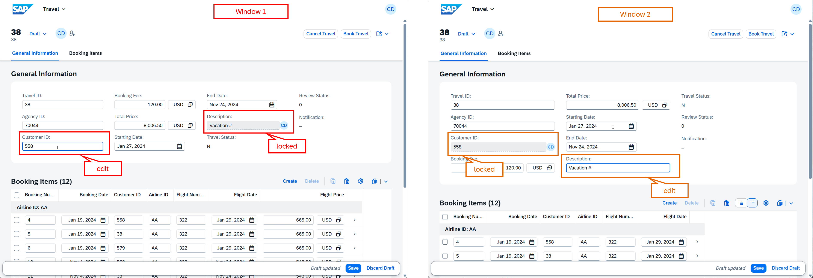

[Home - RAP200](../../README.md)

# Exercise 3: Add Collaborative Draft

## Introduction

In the previous exercise, you've enhanced the RAP BO with determinations, actions, dynamic feature control, and metadata extensions (_see [Exercise 2](../ex02/README.md)_).

In this exercise, you will add collaborative draft handling to the Travel application. This enables multiple users to work on the same business object instance simultaneously. 

### Exercises

- [3.1 - Enhance the base _Travel_ BO Behavior ](#exercise-31-enhance-the-base-travel-bo-behavior)
- [3.2 - Enhance the _Travel_ BO Behavior Projection](#exercise-32-enhance-the-travel-bo-behavior-projection)
- [3.3 - Preview the Enhanced Travel App](#exercise-33-preview-the-enhanced-travel-app)
- [Summary & Next Exercise](#summary--next-exercise)
  
<br/>

> [!TIP]
> <details>
>  <summary>Click to expand ADT tips!</summary>  
>  
> - Always replace all occurrences of the placeholder **`###`** in the provided code snippets with your personal suffix.
> - Use the ADT function _**Find and Replace All**_ (**Ctrl+F**) to quickly replace text in the source code.
> - Use the ADT function _**Quick Fix**_ (**Ctrl+1**), aka _Quick Assist_, on an erroneous element to get help with resolving the issue.
> - Use the **Show ABAP element info** view (**F2**) to inspect an element in ADT editors.
> - Use the **ABAP Formater** function (**Ctrl+F1**) to format your source code.
> - [Useful Keyboard Shortcuts for ABAP Development](https://help.sap.com/docs/ABAP_PLATFORM_NEW/c238d694b825421f940829321ffa326a/4ec299d16e391014adc9fffe4e204223.html?version=latest) (ADT shortcuts)
>
> </details>

> [!NOTE]
> **About Collaborative draft**
> 
> <details>
>  <summary>Click to expand!</summary>  
>
>  <br/>
>  
>  **Collaborative draft** allows multiple users can work concurrently on the same draft instance. All authorized users that have been invited with the draft action Share can make changes, 
  view updates in real time, and work together on the draft without locking each other out. The creator of the draft instance and all other authorized users are allowed to modify, activate, 
  or discard the draft instance.
>
> You can enable a collaborative draft handling by using the keyword `with collaborative draft` in the behavior definition header of a behavior definition of a managed or unmanaged RAP business object.
>   
> Collaborative draft is available in SAP BTP ABAP environment, SAP S/4HANA Cloud Public Edition, and SAP S/4HANA Cloud Private Edition 2025 onwards.
>  
> **Learn more:** [Draft](https://help.sap.com/docs/abap-cloud/abap-rap/draft) | [Draft Handling](https://help.sap.com/docs/abap-cloud/abap-rap/draft-handling) 
>  </details>

---

## Exercise 3.1: Enhance the base _Travel_ BO Behavior
[^Top of page](#)

> Enable the collaborative draft capabilities for the _Travel_ BO `ZR_TRAVEL###`.
>
> For collaborative draft, a draft query view is mandatory for the authorization master entity. Draft query views allow you to define `READ` access limitations for draft data based on the CDS data control language (DCL). 

<details>
  <summary>🔵 Click to expand!</summary>

### Exercise 3.1.1: Adjust the header of the behavior definition

> Adjust the header of the behavior definition `ZR_TRAVEL###`.

<details>
  <summary>🟣 Click to expand!</summary>

1. Open to the behavior definition **`ZR_TRAVEL###`**, and the changes below in the header of the behavior definition: 

   - Replace  **`with draft;`** only in the header section with:

     ```abap
     with collaborative draft;
     ```

2. Add the draft action **`Share`** after the draft determine action **`Prepare`** (i.e. after **`draft determine action Prepare;`**) with the code snippet below:

   ```abap
   draft action Share;
   ```

3. Add the draft query view **`ZR_TRAVEL_QUERY###`** to the draft table declaration in the base behavior definition of the _Travel_ entity using the keyword **`query`**:
   
   > ⚠️ Please note that the specified draft query views `ZR_TRAVEL_QUERY###` will be created in the next exercise (**exercise 3.1.2**).

   For that add **`query ZR_TRAVEL_QUERY###`** to the statement **`draft table ztravel_d###`** as follows:

     ```abap
     draft table ztravel_d### query ZR_TRAVEL_QUERY###
     ```
     
4. Now, enable the collaborative draft for the _Booking_ entity by adjusting the behavior defined after the statement **`define behavior for ZR_BOOKING### alias Booking`** by specifying the draft query view **`ZR_BOOKING_QUERY###`**. 

   For that, add the statement **`query ZR_BOOKING_QUERY###`** to the statement **`draft table zbooking_d###`**, or simply replace it with the one below:

     ```abap
     draft table zbooking_d### query ZR_BOOKING_QUERY###
     ```

   > ⚠️ Please note that the specified draft query views `ZR_BOOKING_QUERY###` will be created in the next exercise (**exercise 3.1.2**).

5. Check out the updated behavior definition below - the updated lines are tagged with `//ex03`:

   <details>
     <summary>ℹ️ Expand to see how the updated source code of bdef ZR_TRAVEL### looks like!</summary>   
     <br/>
     
     ```abap     
       managed implementation in class ZBP_R_TRAVEL### unique;
       strict ( 2 );
       with collaborative draft;                              //ex03
       extensible;
       define behavior for ZR_TRAVEL### alias Travel
       persistent table ztravel###
       extensible
       draft table ztravel_d### query ZR_TRAVEL_QUERY###     //ex03
       etag master LocalLastChangedAt
       lock master total etag LastChangedAt
       authorization master ( global )
       {
         field ( readonly )
         UUID,
         LocalCreatedBy,
         LocalCreatedAt,
         LocalLastChangedBy,
         LocalLastChangedAt,
         LastChangedAt;
       
         field ( numbering : managed )
         UUID;
          
         create;
         update ( features : instance );
         delete ( features : instance );
        
         determination setStatusToNew on modify { create; }
        
         action ( features : instance ) bookTravel result [1] $self;
         action ( features : instance ) cancelTravel result [1] $self;
        
         draft action Activate optimized;
         draft action Discard;
         draft action Edit;
         draft action Resume;
         draft determine action Prepare;
         draft action Share;                              //ex03
        
         mapping for ztravel### corresponding extensible
           {
             UUID               = UUID;
             TravelID           = TRAVEL_ID;
             AgencyID           = AGENCY_ID;
             CustomerID         = CUSTOMER_ID;
             BeginDate          = BEGIN_DATE;
             EndDate            = END_DATE;
             BookingFee         = BOOKING_FEE;
             TotalPrice         = TOTAL_PRICE;
             CurrencyCode       = CURRENCY_CODE;
             Description        = DESCRIPTION;
             Status             = STATUS;
             ReviewStatus       = REVIEW_STATUS;
             Notification       = NOTIFICATION;
             LocalCreatedBy     = LOCAL_CREATED_BY;
             LocalCreatedAt     = LOCAL_CREATED_AT;
             LocalLastChangedBy = LOCAL_LAST_CHANGED_BY;
             LocalLastChangedAt = LOCAL_LAST_CHANGED_AT;
             LastChangedAt      = LAST_CHANGED_AT;
           }
        
         association _Booking { create; with draft; }
        
       }
        
       define behavior for ZR_BOOKING### alias Booking
       persistent table zbooking###
       extensible
       draft table zbooking_d### query ZR_BOOKING_QUERY###   //ex03
       etag dependent by _Travel
       lock dependent by _Travel
       authorization dependent by _Travel
       {
         field ( readonly )
         UUID,
         ParentUUID;
        
         field ( numbering : managed )
         UUID; 
        
         update;
         delete;
        
         mapping for zbooking### corresponding extensible
           {
             UUID         = UUID;
             ParentUUID   = PARENT_UUID;
             BookingID    = BOOKING_ID;
             BookingDate  = BOOKING_DATE;
             CustomerID   = CUSTOMER_ID;
             CarrierID    = CARRIER_ID;
             ConnectionID = CONNECTION_ID;
             FlightDate   = FLIGHT_DATE;
             FlightPrice  = FLIGHT_PRICE;
             CurrencyCode = CURRENCY_CODE;
           }
        
         association _Travel { with draft; }
        
       }
     ```
             
   </details>     
        
6. Save  (**Ctrl+S**) the changes. 

   > ⚠️ You will not be able to activate the data definition at this point due to the missing specified draft query views **`ZR_TRAVEL_QUERY###`** and **`ZR_BOOKING_QUERY###`**, which you're going to create in the next step.
   
<br/>
</details>

### Exercise 3.1.2: Create the draft query views 

> Create the CDS view entities `ZR_TRAVEL_QUERY###` and `ZR_BOOKING_QUERY###` specified as draft query views using the ADT quick fix function (Ctrl+1).

<details>
  <summary>🟣 Click to expand!</summary>
  
1. Create the draft query view **`ZR_TRAVEL_QUERY###`**.

   For that, open the behavior definition **`ZR_TRAVEL###`** and set the cursor on the draft query view name **`ZR_TRAVEL_QUERY###`** for the _Travel_ entity.

   Press **Ctlr+1** to start the Quick Fix view, select the entry **`create query view zr_travel_query### for draft table ztravel_d###`** to start the table creation dialog.

   Keep the prefilled entries and press **Next >**, select a transport request if needed, and press **Finish** to confirm the view creation of the new root view entity **`ZR_TRAVEL_QUERY###`** as your travel draft query view with the draft database table **`ZTRAVEL_D###`** as the referenced object.

   Use the **ABAP Formater** function (**Ctrl+F1**) to format your source code.

   <details>
     <summary>ℹ️ Expand to see how the source code of the generated db table ZR_TRAVEL_QUERY### looks like!</summary>   
     <br/>
     
     ```abap
      @AccessControl.authorizationCheck: #MANDATORY
      @Metadata.allowExtensions: true
      @EndUserText.label: 'Draft query view for ZTRAVEL_D###'
      define root view entity ZR_TRAVEL_QUERY###
        as select from ztravel_d###
      {
        key uuid                          as UUID,
            travelid                      as TravelID,
            agencyid                      as AgencyID,
            customerid                    as CustomerID,
            begindate                     as BeginDate,
            enddate                       as EndDate,
            bookingfee                    as BookingFee,
            totalprice                    as TotalPrice,
            currencycode                  as CurrencyCode,
            description                   as Description,
            status                        as Status,
            reviewstatus                  as ReviewStatus,
            notification                  as Notification,
            localcreatedby                as LocalCreatedBy,
            localcreatedat                as LocalCreatedAt,
            locallastchangedby            as LocalLastChangedBy,
            locallastchangedat            as LocalLastChangedAt,
            lastchangedat                 as LastChangedAt,
            draftentitycreationdatetime   as draftentitycreationdatetime,
            draftentitylastchangedatetime as draftentitylastchangedatetime,
            draftadministrativedatauuid   as draftadministrativedatauuid,
            draftentityoperationcode      as draftentityoperationcode,
            hasactiveentity               as hasactiveentity,
            draftfieldchanges             as draftfieldchanges
      }
     ```
     
   </details>   

3. Save  (**Ctrl+S**) and activate  (**Ctrl+F3**) all changes together.

4. Create the _Booking_ draft query view **`ZR_BOOKING_QUERY###`** similarly using the ADT quick fix function (**Ctrl+1**).

   <details>
     <summary>ℹ️ Expand to see how the source code of the generated db table ZR_BOOKING_QUERY### looks like!</summary>   
   <br/>

     ```abap     
      @AccessControl.authorizationCheck: #MANDATORY
      @Metadata.allowExtensions: true
      @EndUserText.label: 'Draft query view for ZBOOKING_D###'
      define root view entity ZR_BOOKING_QUERY###
        as select from zbooking_d###
      {
        key uuid                          as UUID,
            parentuuid                    as ParentUUID,
            bookingid                     as BookingID,
            bookingdate                   as BookingDate,
            customerid                    as CustomerID,
            carrierid                     as CarrierID,
            connectionid                  as ConnectionID,
            flightdate                    as FlightDate,
            flightprice                   as FlightPrice,
            currencycode                  as CurrencyCode,
            draftentitycreationdatetime   as draftentitycreationdatetime,
            draftentitylastchangedatetime as draftentitylastchangedatetime,
            draftadministrativedatauuid   as draftadministrativedatauuid,
            draftentityoperationcode      as draftentityoperationcode,
            hasactiveentity               as hasactiveentity,
            draftfieldchanges             as draftfieldchanges
      }
     ```
     
   </details>   
   
5. Save  (**Ctrl+S**) and activate  (**Ctrl+F3**) all changes together.

6. Now go back to the behavior definition **`ZR_TRAVEL###`** and activate  (**Ctrl+F3**) the changes.

> ℹ️ If you don't use the offered quick fix, make sure that you don't use the annotation `@Metadata.ignorePropagatedAnnotations` at all or set its value to `false`.

<br/>
</details>


### Exercise 3.1.3: Create access controls for the draft query views

> Create the new CDS access control **`ZR_TRAVEL_QUERY###`** and **`ZR_BOOKING_QUERY###`** for the respective draft query view. The access controls must inherit the access conditions from the respective view entities of the _Travel_ BO, meaning from the view entities **`ZR_TRAVEL_QUERY###`** and **`ZR_BOOKING_QUERY###`**.

<details>
  <summary>🟣 Click to expand!</summary>
  
1. Create the access control **`ZR_TRAVEL_QUERY###`** for the draft query view of the _Travel_ entity.

   For that, go to your exercise package in the **Project Explorer**, navigate to the CDS data definition **`ZR_TRAVEL_QUERY###`**, Right-click on it, and select **New Access Control** from the context menu to start the creatio dialog.

2. Enter the following values in the creation dialog:
  
   | Field | Value |
   |---|---|
   | Name | **`ZR_TRAVEL_QUERY###`** |
   | Description | **`Access control for ZR_TRAVEL_QUERY###`** |     
   | Protected Entity | **`ZR_TRAVEL_QUERY###`** (_value should already be prefilled_) |    

3. Click **Next >** to continue, select a transport request if needed, click **Next >** to continue, select the template **defineRoleWithInheritedConditions**, press **Finish** to confirm the creation. 

4. Replace the placeholder **`cds_source_entity`** with the name of the base BO view entity **`ZR_TRAVEL###`** from which the access conditions should be inherited.   

   ℹ️ The source code of the acces control **`ZR_TRAVEL_QUERY###`** should look like follows:
     
   ```abap
    @EndUserText.label: 'ZR_TRAVEL###'
    @MappingRole: true
    define role ZR_TRAVEL_QUERY### {
        grant  
        select
          on
            ZR_TRAVEL_QUERY###
              where
                inheriting conditions from entity ZR_TRAVEL###;
                
    }
    ```

5. Save  (**Ctrl+S**) and activate  (**Ctrl+F3**) the changes

6. Now, create the access control  **`ZR_BOOKING_QUERY###`** for the draft query view of the _Booking_ entity.

   For that, go to your exercise package in the **Project Explorer**, navigate to the CDS data definition **`ZR_BOOKING_QUERY###`**, Right-click on it, and select **New Access Control** from the context menu to start the creatio dialog.

7. Enter the following values in the creation dialog:

   | Field | Value |
   |---|---|
   | Name | **`ZR_BOOKING_QUERY###`** |
   | Description | **`Access control for ZR_BOOKING_QUERY###`** |     
   | Protected Entity | **`ZR_BOOKING_QUERY###`** (_value should already be prefilled_) |    

8. Click **Next >** to continue, select a transport request if needed, click **Next >** to continue, select the template **defineRoleWithInheritedConditions**, press **Finish** to confirm the creation. 

9. Replace the placeholder **`cds_source_entity`** with the name of the base BO view entity **`ZR_BOOKING###`** from which the access conditions should be inherited.   

   ℹ️ The source code of the acces control **`ZR_BOOKING_QUERY###`** should look like follows:
   
   ```abap
    @EndUserText.label: 'ZR_BOOKING###'
    @MappingRole: true
    define role ZR_BOOKING_QUERY### {
        grant  
        select
          on
            ZR_BOOKING_QUERY###
              where
                inheriting conditions from entity ZR_BOOKING###;
                
    }
    ```

<br/>  
</details>

</details>

## Exercise 3.2: Enhance the _Travel_ BO Behavior Projection
[^Top of page](#)

> Expose the collaborative draft handling, including the `Share` draft action, in the behavior definition of the _Travel_ BO Projection.

<details>
  <summary>🔵 Click to expand!</summary>

1. Open the behavior definition **`ZC_TRAVEL###`** in the **Project Explorer**.

2. Expose the collobarative draft handling by replacing **`use draft;`** with:

   ```abap
   use collaborative draft;
   ```

3. Expose the draft action **`Share`**  with the keyword **`use`**:

   ```abap
     use action Share;
   ```

   <details>
     <summary>ℹ️ Expand to see how the updated source code of ZC_TRAVEL### looks like!</summary>   
     <br/>

     ```abap     
      projection implementation in class ZBP_C_TRAVEL### unique;
      strict ( 2 );
      extensible;
      use collaborative draft;
      use side effects;
      define behavior for ZC_TRAVEL### alias Travel
      extensible
      use etag
      {
      
        field ( readonly ) Status, ReviewStatus, Notification;
      
        use create;
        use update;
        use delete;
      
        use action bookTravel;
        use action cancelTravel;
      
        use action Edit;
        use action Activate;
        use action Discard;
        use action Resume;
        use action Prepare;
        use action Share;
      
        use association _Booking { create; with draft; }
      
      }
      
      define behavior for ZC_BOOKING### alias Booking
      extensible
      use etag
      {
        use update;
        use delete;
      
        use association _Travel { with draft; }
      
      }
     ```
          
   </details>    

4. Save  (**Ctrl+S**) and activate  (**Ctrl+F3**) the changes.

<br/>
</details>


## Exercise 3.3: Preview the Enhanced Travel App
[^Top of page](#)

> Preview the app with collaborative draft handling enabled.

<details>
  <summary>🔵 Click to expand!</summary>

1. Refresh the app in the browser, or go to the **Service Binding**, select the **Travel** entity (leading entity) and start the **SAP Fiori Elements App Preview**.

2. Press **Go** to load the data in the app.

3. Verify that:
   - Multiple users can now collaborate on the same draft instance.
   - The **Share** action is available when editing a Travel instance nad can be used to invite other authorized users.
   - changes made by another user or in another browser session can be see in real time and the specific fields are temporary locked.

     >💡**Hint:**  You can test this feature by using two different users **or** simply by opening the _Travel_ app in two separate browser, then editing the same _travel_ record in both sessions.

   <br/>

    

<br/>
</details>

## Summary & Next Exercise
[^Top of page](#)

Now that you've...
- created draft table query views for Travel and Booking,
- created access controls for the draft table query views,
- enabled collaborative draft in the behavior definitions and projection, and
- exposed the Share action,

you can continue with the next exercise – **[Exercise 4: Add Event-Driven RAP Side Effects](../ex04/README.md)**

---
