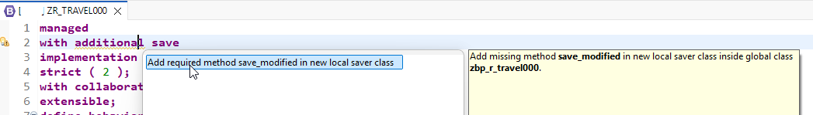
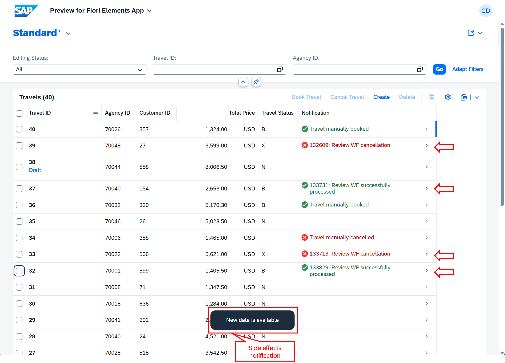

[Home - RAP200](../../README.md)

# Exercise 4: Add Event-driven RAP Side Effects

## Introduction

In the previous exercise, you've added collaborative draft handling to the Travel application (_see [Exercise 3](../ex03/README.md)_).

In this exercise, you will implement event-driven RAP side effects for the _travel_ entity. You will define and implement an event called `StatusUpdated` and define appropriate event-driven side effects to refresh the fields `Status`, `ReviewStatus`, and `Notification` whenever the event is raised. Additionaly, you will create a class to simulate an external update of the travel status via an EML (Entity Manipulation Language) call.

### Exercises

- [4.1 - Add the Event-driven RAP Side Effects to the Base _Travel_ BO](#exercise-41-add-the-event-driven-rap-side-effects-to-the-base-travel-bo-behavior)
- [4.2 - Raise the event in the _Travel_ Behavior Pool](#exercise-42-raise-the-event-in-the-travel-behavior-pool)
- [4.3 - Expose the Event-driven Side Effect in the _Travel_ BO Projection](#exercise-43-expose-the-event-driven-side-effect-in-the-travel-bo-projection)
- [4.4 - Create an ABAP Class simulating an External EML Call](#exercise-44-create-an-abap-class-simulating-an-external-eml-call)
- [4.5 - Preview the Enhanced Travel App](#exercise-45-preview-the-enhanced-travel-app)
- [Summary & Next Exercise](#summary--next-exercise)

<br/>

> [!TIP]
> <details>
>  <summary>Click to expand ADT tips!</summary>  
>  
> - Always replace all occurrences of the placeholder **`###`** in the provided code snippets with your personal suffix.
> - Use the ADT function _**Find and Replace All**_ (**Ctrl+F**) to quickly replace text in the source code.
> - Use the ADT function _**Quick Fix**_ (**Ctrl+1**), aka _Quick Assist_, on an erroneous element to get help with resolving the issue.
> - Use the **Show ABAP element info** view (**F2**) to inspect an element in ADT editors.
> - Use the **ABAP Formater** function (**Ctrl+F1**) to format your source code.
> - [Useful Keyboard Shortcuts for ABAP Development](https://help.sap.com/docs/ABAP_PLATFORM_NEW/c238d694b825421f940829321ffa326a/4ec299d16e391014adc9fffe4e204223.html?version=latest) (ADT shortcuts)
>
> </details>

> [!NOTE]
> **About Event-Driven Side Effects**
> 
> <details>
>  <summary>Click to expand!</summary>  
>
>  <br/>
>  
> RAP Side effects (hereafter: side effect) are used to reload data, permissions, or messages or trigger determine actions based on data changes in UI scenarios with draft-enabled BOs. Since draft-enabled scenarios use a stateless communication pattern, the UI doesn't trigger a reload of all BO-related properties for every user input. In particular, RAP side effects are efficient since there is no full reload of all BO-properties, but only of those that are affected by particular user input.
> Different types of RAP side effects are available.
> 
>  **An event-driven side effect** is a side effect that is triggered whenever a defined business event (hereafter: event) is raised by the application server to reload the defined targets.
>   
> Event-driven side effects are available in SAP BTP ABAP environment, SAP S/4HANA Cloud Public Edition, and SAP S/4HANA Cloud Private Edition 2025 onwards.
>  
> **Learn more:** [RAP Side Effects](https://help.sap.com/docs/abap-cloud/abap-rap/side-effects) | [Developing RAP Side Effects](https://help.sap.com/docs/abap-cloud/abap-rap/developing-side-effects)
>  </details>

---

## Exercise 4.1: Add the Event-driven RAP Side Effects to the Base _Travel_ BO behavior

> Define and implement an event-driven for RAP Side Effects in the base behavior definition `ZR_TRAVEL###` to refresh the fields `Status`, `ReviewStatus`, and `Notification` whenever the `StatusUpdated` event is raised.
> 
> For that, You will define the event for RAP side effects `StatusUpdated` and an event-driven RAP side effect to refresh the fields when the event is triggered. Then you will implement the `save_modified` method in a local saver class to raise the event during the save sequence in the behavior pool `ZBP_R_TRAVEL###`. 

<details>
  <summary>🔵 Click to expand!</summary>

1. Open the behavior definition **`ZR_TRAVEL###`** in the **Project Explorer**.

2. Add the event definition for side effects **`StatusUpdated`** to the behavior definition of the _Travel_ BO entity **`ZR_TRAVEL###`** using the code snippet below.

   ```abap
     event StatusUpdated for side effects;
   ```       

3. Add the statement **`with additional save`** after the keyword **`managed`** in the header section of the behavior definition using the code snippet below. 

   > ℹ️ Business events must be raised in the save sequence. in case of _managed_ implementation, the statement `with additional save` or `with unmanaged save`
   > need to be added to the behavior definition to raise an event.

   ```abap
     with additional save
   ```   

4. Add the event-driven side effects using the code snippet below. 

   ```abap
     side effects
     {
       event StatusUpdated affects field ( Status, ReviewStatus, Notification );
     }
   ```

   
5. You can take a look at the changed lines (tagged with `//ex04`) in the behavior definition `ZR_TRAVEL###` in the document linked below:

   > ℹ️📄Source code document: [ex04_bdef_ZR_TRAVEL###.txt](sources/ex04_bdef_ZR_TRAVEL.txt)
   
   <!--   

   <details>
     <summary>ℹ️📄 Click to expand the source code document!</summary>

     <br/>

   ```abap
    managed
    with additional save                                  //ex04
    implementation in class ZBP_R_TRAVEL### unique;
    strict ( 2 );
    with collaborative draft;                             //ex03
    extensible;
    define behavior for ZR_TRAVEL### alias Travel
    persistent table ztravel###
    extensible
    draft table ztravel_d### query ZR_TRAVEL_QUERY###     //ex03
    etag master LocalLastChangedAt
    lock master total etag LastChangedAt
    authorization master ( global )
    {
      field ( readonly )
      UUID,
      LocalCreatedBy,
      LocalCreatedAt,
      LocalLastChangedBy,
      LocalLastChangedAt,
      LastChangedAt;
  
      field ( numbering : managed )
      UUID;
  
      event StatusUpdated for side effects;               //ex04
  
      side effects                                        //ex04
      {
        event StatusUpdated affects field ( Status, ReviewStatus, Notification );
      }
  
      create;
      update ( features : instance );                                    //ex02
      delete ( features : instance );                                    //ex02
  
      determination setStatusToNew on modify { create; }                 //ex02
  
      action ( features : instance ) bookTravel result [1] $self;        //ex02
      action ( features : instance ) cancelTravel result [1] $self;      //ex02
  
      draft action Activate optimized;
      draft action Discard;
      draft action Edit;
      draft action Resume;
      draft determine action Prepare;
      draft action Share;                              //ex03
  
      mapping for ztravel### corresponding extensible
        {
          UUID               = UUID;
          TravelID           = TRAVEL_ID;
          AgencyID           = AGENCY_ID;
          CustomerID         = CUSTOMER_ID;
          BeginDate          = BEGIN_DATE;
          EndDate            = END_DATE;
          BookingFee         = BOOKING_FEE;
          TotalPrice         = TOTAL_PRICE;
          CurrencyCode       = CURRENCY_CODE;
          Description        = DESCRIPTION;
          Status             = STATUS;
          ReviewStatus       = REVIEW_STATUS;
          Notification       = NOTIFICATION;
          LocalCreatedBy     = LOCAL_CREATED_BY;
          LocalCreatedAt     = LOCAL_CREATED_AT;
          LocalLastChangedBy = LOCAL_LAST_CHANGED_BY;
          LocalLastChangedAt = LOCAL_LAST_CHANGED_AT;
          LastChangedAt      = LAST_CHANGED_AT;
        }
  
      association _Booking { create; with draft; }
  
    }
  
    define behavior for ZR_BOOKING### alias Booking
    persistent table zbooking###
    extensible
    draft table zbooking_d### query ZR_BOOKING_QUERY###   //ex03
    etag dependent by _Travel
    lock dependent by _Travel
    authorization dependent by _Travel
    {
      field ( readonly )
      UUID,
      ParentUUID;
  
      field ( numbering : managed )
      UUID;
  
      update;
      delete;
  
      mapping for zbooking### corresponding extensible
        {
          UUID         = UUID;
          ParentUUID   = PARENT_UUID;
          BookingID    = BOOKING_ID;
          BookingDate  = BOOKING_DATE;
          CustomerID   = CUSTOMER_ID;
          CarrierID    = CARRIER_ID;
          ConnectionID = CONNECTION_ID;
          FlightDate   = FLIGHT_DATE;
          FlightPrice  = FLIGHT_PRICE;
          CurrencyCode = CURRENCY_CODE;
        }
  
      association _Travel { with draft; }
  
    }
   ``` 
   
   </details>  

   -->

6. Save  (**Ctrl+S**) and activate  (**Ctrl+F3**) the changes.

</details>

## Exercise 4.2: Raise the event in the _Travel_ Behavior Pool

[^Top of page](#)

> Implement the Additional Save Logic in the `save_modified` method in a local saver class `lsc_zr_travel###` to raise the event during the save sequence in the _travel_ behavior pool `ZBP_R_TRAVEL###`.

<details>
  <summary>🔵 Click to expand!</summary>

1. Go to the behavior definition **`ZR_TRAVEL###`**.

2. Enhance the definition of the behavior pool **`ZBP_R_TRAVEL###`** using the ADT quick fix..

   For that, set the cursor on the statement **`additional save`**, press **Ctrl+1** to trigger the quick fix view, and double-click the entry to add the missing method **`save_modified`**
   in a new local saver class inside global class **`zbp_r_travel###`**.

    

   The behavior implementation class will be updated with the local saver handler class.

4. Navigate to the local saver class **`lsc_zr_travel###`** in the behavior pool **`ZBP_R_TRAVEL###`** (tab **Local Types**).

5. Implement the method **`save_modified`** with the source code provided below. Replace all occurrences of **`###`** with your personal suffix.

   ```abap
    METHOD save_modified.
      DATA: Travels             TYPE STANDARD TABLE OF ZR_Travel###,
            Travel              TYPE                   ZR_Travel###,
            events_to_be_raised TYPE TABLE FOR EVENT ZR_Travel###~StatusUpdated.
  
      "raise the event whenever the status is changed to 'A' (Accepted)
      IF update-travel IS NOT INITIAL.
        LOOP AT update-travel INTO DATA(update_travel).
          CLEAR events_to_be_raised.
  
          IF update_travel-%control-ReviewStatus = if_abap_behv=>mk-on.
            APPEND INITIAL LINE TO events_to_be_raised.
            events_to_be_raised[ 1 ] = CORRESPONDING #( update_travel ).
            RAISE ENTITY EVENT ZR_Travel###~StatusUpdated FROM events_to_be_raised.
          ENDIF.
        ENDLOOP.
      ENDIF.
    ENDMETHOD.
   ```

7. You can take a look at the entire updated source code of `ZBP_R_TRAVEL###` in the document linked below:

   > ℹ️📄Source code document: [ex04_class_ZBP_R_TRAVEL###.txt](sources/ex04_class_ZBP_R_TRAVEL.txt)

8. Save  (**Ctrl+S**) and activate  (**Ctrl+F3**) the changes.

</details>


## Exercise 4.3: Expose the Event-driven Side Effect in the _Travel_ BO Projection
[^Top of page](#)

> Expose the `TravelAccepted` event and the RAP side effect in the behavior projection `ZC_TRAVEL###`.

<details>
  <summary>🔵 Click to expand!</summary>

1. Open the behavior projection **`ZC_TRAVEL###`**.

2. Expose the side effects by adding the statement below after the draft handling statement in the header section of the _travel_ entity behavior: 

   > 💡 You may skip this step, as the statement should normally already be included in the generated projection. Just check that it's there.

   ```abap
     use side effects;
   ``` 

3. Expose the event by adding the statement below to the behavior of the _Travel_ entity `ZC_TRAVEL###`, e.g. after the static feature control:

   ```abap
     use event StatusUpdated;
   ```
   
4. You can take a look at the updated behavior projection `ZC_TRAVEL###`, with the changed lines tagged with `//ex04`:

   > ℹ️📄Source code document: [ex04_bdef_ZC_TRAVEL###.txt](sources/ex04_bdef_ZC_TRAVEL.txt)

   <!--

   <details>
     <summary>ℹ️Click to expand to view the source code!</summary>
     
   ```abap
    projection implementation in class ZBP_C_TRAVEL### unique;
    strict ( 2 );
    extensible;
    use collaborative draft;
    use side effects;                               //ex04
    define behavior for ZC_TRAVEL### alias Travel
    extensible
    use etag
    {
    
      field ( readonly ) Status, ReviewStatus, Notification;
    
      use event StatusUpdated;                      //ex04
    
      use create;
      use update;
      use delete;
    
      use action bookTravel;
      use action cancelTravel;
    
      use action Edit;
      use action Activate;
      use action Discard;
      use action Resume;
      use action Prepare;
      use action Share;
    
      use association _Booking { create; with draft; }
    
    }
    
    define behavior for ZC_BOOKING### alias Booking
    extensible
    use etag
    {
      use update;
      use delete;
    
      use association _Travel { with draft; }
    
    }
   ```
          
   </details>  

   -->

4. Save  (**Ctrl+S**) and activate  (**Ctrl+F3**) the changes.

</details>


## Exercise 4.4: Create an ABAP Class simulating an External EML Call
[^Top of page](#)

> Create the ABAP class `ZRAP200_EXTERNAL_EML_CALL_###` to simulate an external status update via Entity Manipulation Language (EML).
> 
> The class will simulate a dummy review workflow and use EML call to set the status and review status via a `MODIFY ENTITIES` statement and persist the changes via a `COMMIT ENTITIES` statement. The field `ReviewStatus` will be updated to trigger the event-driven RAP side effects for the event `StatusUpdated` in the _Travel_ App.

<details>
  <summary>🔵 Click to expand!</summary>

1. Right-click on your exercise package **`ZRAP200_###`** and select **New** > **ABAP Class** from the context menu.

2. Enter the following values:

   | Field | Value |
   |---|---|
   | Name | **`ZRAP200_EXTERNAL_EML_CALL_###`** |
   | Description | **`Simulate external EML call`** |
   | Package | **`ZRAP200_###`** |   

3. Replace the entire source code with the version provided below and replace all occurrences of **`###`** with your personal suffix.
   
   > 🟣📄Source code document: [ex04_class_ZRAP200_EXTERNAL_EML_CALL_###.txt](sources/ex04_class_ZRAP200_EXTERNAL_EML_CALL.txt)

   <details>
     <summary>ℹ️ Brief explanantion - Click to expand!</summary>
     
   - The method **`review_travel_bo()`** is used to simulate a dummy time-intensive review workflow process. All _travel_ records with a total price higher that `0` and lower than `3.000` will be booked successfuly, otherwise they will be cancelled.

   - The method **`if_oo_adt_classrun~main( )`** is used to execute (**F9**) an update of the travel record specified in the variable **`travel_id`** (data type: `numc(8)`) - e.g. 
     ```abap 
     travel_id = 00000039 
     ```
   </details>
     
   <!--
   <details>
     <summary>📄Click to expand the source code of ZRAP200_EXTERNAL_EML_CALL_###!</summary>

   <br/>
     
   > 💡 Replace all occurences of the placeholder `###` with your personal suffix.
  
   ```abap
   CLASS zrap200_external_eml_call_### DEFINITION
     PUBLIC
     FINAL
     CREATE PUBLIC .
  
     PUBLIC SECTION.
       INTERFACES if_oo_adt_classrun.
  
       METHODS:
         constructor IMPORTING i_rap_bo_key TYPE sysuuid_x16 OPTIONAL
                               i_travel_id  TYPE /dmo/travel_id OPTIONAL,
  
         review_travel_bo RETURNING VALUE(notification) TYPE string.
  
     PROTECTED SECTION.
  
     PRIVATE SECTION.
       DATA:
         rap_bo_key TYPE sysuuid_x16,
         travel_id  TYPE /dmo/travel_id.
  
   ENDCLASS.
  
  
   CLASS zrap200_external_eml_call_### IMPLEMENTATION.
  
     METHOD constructor.
       rap_bo_key = i_rap_bo_key.
       travel_id  = i_travel_id.
     ENDMETHOD.
  
     METHOD if_oo_adt_classrun~main.
   
       "Travel ID to be updated
       travel_id  = 00000039.
  
       "read bo entity instance key from the db
       SELECT SINGLE uuid FROM zr_travel###
           WHERE TravelID = @travel_id
           INTO @rap_bo_key .
  
       CHECK rap_bo_key IS NOT INITIAL.
  
       "call the dummy review workflow process
       DATA(notification) = review_travel_bo( ).
  
       out->write( | [Notification] { notification } for { travel_id }. | ).
     ENDMETHOD.
    
     METHOD review_travel_bo.
       DATA: status        TYPE /dmo/travel_status,
             review_status TYPE int1.
  
       "dummy time-intensive review workflow process
       SELECT SINGLE TotalPrice FROM zr_travel###
           WHERE uuid = @rap_bo_key
           INTO @DATA(total_price).
  
       WAIT UP TO 8 SECONDS.
  
       IF total_price < 3000 AND total_price > 0.
         review_status = zrap200_if_travel###=>review_status-booked.
         status = zrap200_if_travel###=>travel_status-booked.
         notification = |{ cl_abap_context_info=>get_system_time(  ) }: Review WF successfully processed|.
       ELSE.
         review_status = zrap200_if_travel###=>review_status-cancelled.
         status = zrap200_if_travel###=>travel_status-cancelled.
         notification = |{ cl_abap_context_info=>get_system_time(  ) }: Review WF cancellation|.
       ENDIF.
  
       "modify relevant travel instance
       MODIFY ENTITIES OF ZR_Travel###
          ENTITY Travel
          UPDATE FIELDS ( Status ReviewStatus Notification )
          WITH VALUE #( ( %tky-uuid    = rap_bo_key
                          status       = status
                          reviewStatus = review_status
                          notification = notification  ) )
       FAILED DATA(modify_failed)
       REPORTED DATA(modify_reported).
  
       "commit changes
       COMMIT ENTITIES RESPONSES
           FAILED   DATA(commit_failed)
           REPORTED DATA(commit_reported).
  
     ENDMETHOD.
   ENDCLASS.
   ```
   
   </details>
   -->

5. Save  (**Ctrl+S**) and activate  (**Ctrl+F3**) the changes.

</details>

## Exercise 4.5: Preview the Enhanced Travel App
[^Top of page](#)

> Preview the enhanced _Travel_ app with event-driven RAP side effects .

<details>
  <summary>🔵 Click to expand!</summary>

1. Refresh the app in the browser, or go to the **Service Binding**, select the **Travel** entity (leading entity) and start the **SAP Fiori Elements App Preview**.

2. Press **Go** to load the data in the app.

   > 💡Position your browser with the _travel_ app and the ADT window side-by-side so you can see both at the same time.

3. No go the class `ZRAP200_EXTERNAL_EML_CALL_###` as a **Console App** to test the external EML call.
   
   1. Go to the method **`if_oo_adt_classrun~main()`**
   2. Update the variable **`travel_id`** with the travel ID of a travel record with the status _New_ (**N**) in the _Travel_ app
   3. Save  and activate   the change.
   4. Execute the class via **F9** and go  quickly back to the _travel_ app in the browser
     
4. In the _Travel_ app in the browser, the notification **`New data is available`** should be displayed **after a few seconds**, and the fields **`Status`** and **Notification** should be updated without you having to manualy reload the data with the **Go** button. 
   
   > The field  **`ReviewStatus`** is updated but not shown in the list report table. You can enable it in the medata data extension of the _travel_ entity if needed.

5. Verify that the dummy review workflow set following notification:

   - **`<system_time>: Review WF successfully processed`** for the travel status **`B`** (i.e. review status **`3`**)

   - **`<system_time>: Review WF cancellation`** for the travel status **`X`** (i.e. review status **`1`**)

   <br/>
   
    
   
</details>

## Summary & Next Exercise
[^Top of page](#)

Now that you've...
- defined the `StatusUpdated` event for side effects,
- configured side effects to refresh the `Status` and `Notification` fields,
- implemented the additional save logic to raise the event, and
- created a class to simulate an external EML call,

you can continue with the next exercise – **[Exercise 5: Using the Backgroung Processing Framework (bgPF)](../ex05/README.md)**

---
