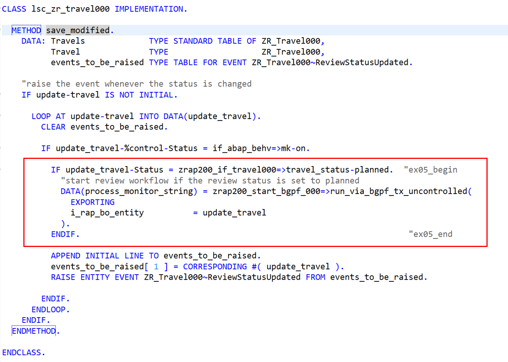
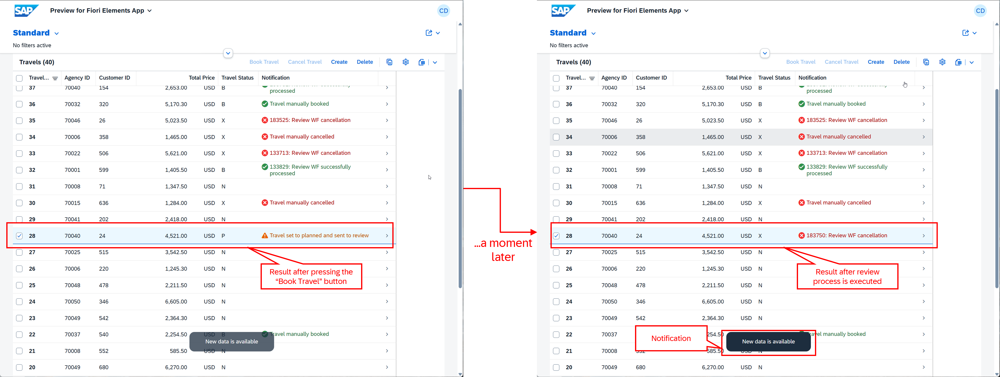

[Home - RAP200](../../README.md)

# Exercise 5: Using the Backgroung Processing Framework (bgPF)

## Introduction

In the previous exercise, you've implemented event-driven side effects and simulated an external EML calls (_see [Exercise 4](../ex04/README.md)_). 

In this exercise, you will learn how to use the Background Processing Framework (bgPF) to asynchronously trigger an external process within a RAP BO. You will be calling the dummy review worflow process implemented in the preview exercise in the method `REVIEW_TRAVEL_BO()` of the ABAP class `ZRAP200_START_BGPF_###`.

To achieve that, you will adapt the logic of the action `bookTravel` so that, it sets the travel status of the selected _travel_ instances to _Planned_ (`P`) and triggers the review workflow. The workflow will either set the travel status to _Booked_ (`B`) or _Cancelled_ (`X`) depending on the result. 
  
### Exercises

- [5.1 - Adjust the _Travel_ BO Behavior Pool - Part 1](#exercise-51-adjust-the-travel-bo-behavior-pool---part-1)
- [5.2 - Create the bgPF Starter Class](#exercise-52-create-the-bgpf-starter-class)
- [5.3 - Adjust the _Travel_ BO Behavior Pool - Part 2](#exercise-53-adjust-the-travel-bo-pehavior-pool---part-2) 
- [5.4 - Preview and Test the Enhanced Travel App](#exercise-54-preview-and-test-the-enhanced-travel-app)
- [Summary & Next Exercise](#summary--next-exercise)

<br/>

> [!TIP]
> <details>
>  <summary>Click to expand ADT tips!</summary>  
>  
> - Always replace all occurrences of the placeholder **`###`** in the provided code snippets with your personal suffix.
> - Use the ADT function _**Find and Replace All**_ (**Ctrl+F**) to quickly replace text in the source code.
> - Use the ADT function _**Quick Fix**_ (**Ctrl+1**), aka _Quick Assist_, on an erroneous element to get help with resolving the issue.
> - Use the **Show ABAP element info** view (**F2**) to inspect an element in ADT editors.
> - Use the **ABAP Formater** function (**Ctrl+F1**) to format your source code.
> - [Useful Keyboard Shortcuts for ABAP Development](https://help.sap.com/docs/ABAP_PLATFORM_NEW/c238d694b825421f940829321ffa326a/4ec299d16e391014adc9fffe4e204223.html?version=latest) (ADT shortcuts)
>
> </details>

> [!NOTE]
> **About the Background Processing Framework (bgPF)**
> 
> <details>
>  <summary>Click to expand!</summary>  
>  <br/>
>   
> The **background processing framework (bgPF)** is a framework that asynchronously and reliably executes methods of applications that develop background processes.  
>   
> Technically, **bgPF** builds on the background remote function call (bgRFC), wrapping it and extensding its functionality. As a successor of the transactional remote function call (tRFC) and the queued remote function call (qRFC), **bgRFC** delivers improved runtime performance through efficient, scalable, and transactional processing of large numbers of sequential function calls. 
>   
> Unlike bgRFC, which supports inbound, outbound, and out-in scenarios, **bgPF** supports only the inbound scenario. This means the sending system and the receiving system are identical, and the remote call runs in a new session. 
>  
> **Learn more:** [Background Processing Framework in ABAP Cloud](https://help.sap.com/docs/abap-cloud/abap-concepts/background-processing-framework) 
>  </details>

---

## Exercise 5.1: Adjust the _Travel_ BO Behavior Pool - Part 1
[^Top of page](#)

> Declare a public type `t_travel_for_change` in the global call of the _Travel_BO beahvior pool `ZBP_R_TRAVEL###`.
> 
> This type will be used in the following exercise to access easily the derived BO type outside the _Travel_ RAP BO.

<details>
  <summary>🔵 Click to expand!</summary>

1. Open the _travel_ BO behavior pool **`ZBP_R_TRAVEL###`** in the **Project Explorer**:

2. Go to the **Global Class** tab and declare the new type **`t_travel_for_change`** in the public section:

   ```abap
    "to be used in BGPF class
    TYPES t_travel_for_change TYPE STRUCTURE FOR CHANGE zr_travel###\\travel.     
   ``` 

   <details>
     <summary>ℹ️📄Click to review the updated source code of the global class!</summary>
     
   ```abap
    CLASS zbp_r_travel### DEFINITION
      PUBLIC
      ABSTRACT
      FINAL
      FOR BEHAVIOR OF zr_travel### .
    
      PUBLIC SECTION.
        "to be used in BGPF class
        TYPES t_travel_for_change TYPE STRUCTURE FOR CHANGE zr_travel###\\travel.
    
      PROTECTED SECTION.
      PRIVATE SECTION.
    ENDCLASS.
    
    CLASS zbp_r_travel### IMPLEMENTATION.
    ENDCLASS.
   ```           
   </details>  

3. Save  (**Ctrl+S**) and activate  (**Ctrl+F3**) the changes.

   <br/>
   
</details>


## Exercise 5.2: Create the bgPF Starter Class
[^Top of page](#)

> Create and implement the ABAP class `ZRAP200_START_BGPF_###`, which will be used to start the review process asynchronously later in the _Travel_ BO behavior pool.

<details>
  <summary>🔵 Click to expand!</summary>

1. Right-click on your exercise package **`ZRAP200_###`** and select **New** > **ABAP Class**.

2. Enter the following values:

   | Field | Value |
   |---|---|
   | Name | **`ZRAP200_START_BGPF_###`** |
   | Description | **`RAP200: bgPF class for ###`** |

3. Replace the entire source code of **`ZRAP200_START_BGPF_###`** with the version provided below and replace all occurrences of the placeholder **`###`** with your personal suffix:

   ▶📄Source code document: [ex05_class_ZRAP200_START_BGPF_###.txt](sources/ex05_class_ZRAP200_START_BGPF.txt)

   <details>
     <summary>ℹ️Brief explanation - Click to expand ...🚧...!</summary>
      
     > - Following Interfaces must be implemented: **`if_serializable_object`**, **`if_bgmc_operation`**, and **`if_bgmc_op_single_tx_uncontr`**
     >  
     > - Constant **`bgpf_state`** for the different bgpf states
     >  
     > - **`constructor()`**: Hand-over of the given _Travel_ BO entity
     >  
     > - **`run_via_bgpf_tx_uncontrolled()`**: main method Implemented as class method, ...
     >   - bgpF: serialzation ...🚧...
       
   </details>  

<!--
   <details>
     <summary>🟣📄 Click to expand the source code!</summary>

   ```abap
    CLASS zrap200_start_bgpf_### DEFINITION
      PUBLIC
      FINAL
      CREATE PUBLIC .
    
      PUBLIC SECTION.
        INTERFACES if_serializable_object.
        INTERFACES if_bgmc_operation.
        INTERFACES if_bgmc_op_single_tx_uncontr.
    
        CLASS-METHODS run_via_bgpf_tx_uncontrolled
          IMPORTING i_rap_bo_entity                 TYPE zbp_r_travel###=>t_travel_for_change
          RETURNING VALUE(r_process_monitor_string) TYPE string.
    
        METHODS constructor
          IMPORTING i_rap_bo_entity TYPE zbp_r_travel###=>t_travel_for_change.
    
        CONSTANTS:
          BEGIN OF bgpf_state,
            unknown         TYPE int1 VALUE IS INITIAL,
            erroneous       TYPE int1 VALUE 1,
            new             TYPE int1 VALUE 2,
            running         TYPE int1 VALUE 3,
            successful      TYPE int1 VALUE 4,
            started_from_bo TYPE int1 VALUE 99,
          END OF bgpf_state.
    
      PROTECTED SECTION.
      PRIVATE SECTION.
        DATA rap_bo_line TYPE zbp_r_travel###=>t_travel_for_change .
    ENDCLASS.
    
    CLASS zrap200_start_bgpf_### IMPLEMENTATION.
        
      METHOD constructor.
        rap_bo_line = i_rap_bo_entity.
      ENDMETHOD.
    
      METHOD if_bgmc_op_single_tx_uncontr~execute.
    
        DATA rap_update TYPE REF TO zrap200_external_eml_call_### .
    
        rap_update = NEW #(
           i_rap_bo_key = rap_bo_line-uuid
           i_travel_id  = rap_bo_line-TravelID
        ).
    
        rap_update->review_travel_bo( ).
    
      ENDMETHOD.
    
      METHOD run_via_bgpf_tx_uncontrolled.
        TRY.
            DATA(process_monitor) = cl_bgmc_process_factory=>get_default( )->create(
                                                  )->set_name( |Long running process { i_rap_bo_entity-UUID }|
                                                  )->set_operation_tx_uncontrolled(  NEW zrap200_start_bgpf_###( i_rap_bo_entity = i_rap_bo_entity )
                                                  )->save_for_execution( ).
            r_process_monitor_string = process_monitor->to_string( ).
          CATCH cx_bgmc INTO DATA(lx_bgmc).
        ENDTRY.
      ENDMETHOD.
    
    ENDCLASS.
   ```   
   </details>     
--> 

4. Save  (**Ctrl+S**) and activate  (**Ctrl+F3**) the changes.

   <br/>
   
</details>

## Exercise 5.3: Adjust the _Travel_ BO Pehavior Pool - Part 2

> Adjust the business logic of the _Travel_ BO behavior Pool `ZBP_R_TRAVEL###`. First, you will adjust the business logic of the implementation of the action `bookTravel()` in the local handler class `lhc_zr_travel###` to reflect the new process, then you will enhance the business logic of the `save_modified()` method of the local saver class `lsc_zr_travel###` to trigger the asynchronous review workflow.

<details>
  <summary>🔵 Click to expand!</summary>

### Exercise 5.3.1: Adjust the implementation of the `bookTravel()` method in local handler class
[^Top of page](#)

> Adjust the business logic of the implementation of the action `bookTravel()` in the local handler class **`lhc_zr_travel###`** of the _Travel_ BO behavior Pool.
>  
> From now on, when the `bookTravel` action is triggered, the travel status of the selected _travel_ instances is set to _Planned_ (`P`), and the review workflow is triggered and processed asynchronously. The workflow then sets the travel status to _Booked_ (`B`) or _Cancelled_ (`X`) depending on the processing result. 

<details>
  <summary>🟣 Click to expand!</summary>

1. Open the _travel_ BO behavior pool **`ZBP_R_TRAVEL###`** in the **Project Explorer**, go to the **Local Types** tab and navigate to the implementation of the method **`bookTravel()`** in the local handler class **`lhc_zr_travel###`**.

2. Set the fields travel status **`Status`** and the review status **`ReviewStatus`** to planned, i.e. `P` and `2` respectively, and change the notification **`Notification`** to **`Travel set to planned and sent to review`** in the **`MODIFY ENTITIES`** statement: 

   > - `Status`       = `P` - use `zrap200_if_travel###=>travel_status-planned`
   > - `ReviewStatus` = `2` - use `zrap200_if_travel###=>review_status-planned `

   To achieve that, replace the **`MODIFY ENTITIES`** statement in the method **`bookTravel`** with the version provided below, and replace the placeholder **`###`** with your personal suffix.
   
   ```abap
   MODIFY ENTITIES OF ZR_Travel### IN LOCAL MODE
      ENTITY Travel
      UPDATE FIELDS ( Status ReviewStatus Notification )
      WITH VALUE #( FOR key IN keys ( %tky    = key-%tky
                                       Status       = zrap200_if_travel###=>travel_status-planned   "ex05
                                       ReviewStatus = zrap200_if_travel###=>review_status-planned   "ex05
                                       Notification = 'Travel set to planned and sent to review'    "ex05
                                     ) )
   ```           
  
   The updated implementation of the **`bookTravel()`** method now looks as follow: 

   <details>
     <summary>ℹ️📄 Click to expand the source code!</summary>
    
   ```abap
    METHOD bookTravel.
      "modify travel instance(s)
      "update the travel status, as well as the review status and the notification
      MODIFY ENTITIES OF ZR_Travel### IN LOCAL MODE
         ENTITY Travel
         UPDATE FIELDS ( Status ReviewStatus Notification )
         WITH VALUE #( FOR key IN keys ( %tky    = key-%tky
                                          Status       = zrap200_if_travel###=>travel_status-planned   "ex05
                                          ReviewStatus = zrap200_if_travel###=>review_status-planned   "ex05
                                          Notification = 'Travel set to planned and sent to review'    "ex05
                                        ) )
      FAILED failed
      REPORTED reported.
  
      "read changed data for action result
      READ ENTITIES OF ZR_Travel### IN LOCAL MODE
         ENTITY Travel
         ALL FIELDS WITH
         CORRESPONDING #( keys )
         RESULT DATA(travels).
  
      "set the action result parameter
      result = VALUE #( FOR travel IN travels ( %tky   = travel-%tky
                                                %param = travel ) ).
    ENDMETHOD.
   ```
   </details>  

3. Save  (**Ctrl+S**) the changes and continue with the next step.

   <br/>
   
</details>

### Exercise 5.3.2: Adjust the implementation of the  local saver class
[^Top of page](#)

> Adjust the business logic of the implementation of the `save_modified()` method in the local saver class `lsc_zr_travel###` of the _Travel_ BO behavior Pool.
> 
> From now on, the review workflow is started asynchronously whenever the travel status `Status` is changed to _Planned_ (`P`), in addition to the `StatusUpdated` event, which is raised every time the travel status changes. 

<details>
  <summary>🟣 Click to expand!</summary>

1. No go to the implementation of the method **`save_modified()`** in the local saver class **`lsc_zr_travel###`** of the _Travel_ BO behavior pool **`ZBP_R_TRAVEL###`**.

2. Enhance the implentation of the **`save_modified()`** method with the code snippet below as shown on the screenshot: 
   
   > ⚠️ It is important to place it before the **`RAISE ENTITY EVENT`** statement, as everything placed after it is no longer processed in the current loop.
  
   ```abap
          IF update_travel-Status = zrap200_if_travel###=>travel_status-planned.
            "start review workflow if the review status is set to planned
            DATA(process_monitor_string) = zrap200_start_bgpf_###=>run_via_bgpf_tx_uncontrolled(
              EXPORTING
              i_rap_bo_entity          = update_travel
            ).
          ENDIF.
   ```           
  
    

   The updated implementation of the **`bookTravel()`** method now looks as follow: 

   <details>
     <summary>ℹ️📄Click to view the source code!</summary>
    
   ```abap
   METHOD save_modified.
    DATA: Travels             TYPE STANDARD TABLE OF ZR_Travel###,
          Travel              TYPE                   ZR_Travel###,
          events_to_be_raised TYPE TABLE FOR EVENT ZR_Travel###~StatusUpdated.

    "raise the event whenever the status is changed
    IF update-travel IS NOT INITIAL.

      LOOP AT update-travel INTO DATA(update_travel).
        CLEAR events_to_be_raised.

        IF update_travel-%control-Status = if_abap_behv=>mk-on.

          IF update_travel-Status = zrap200_if_travel###=>travel_status-planned.   "ex05_begin
            "start review workflow if the review status is set to planned
            DATA(process_monitor_string) = zrap200_start_bgpf_###=>run_via_bgpf_tx_uncontrolled(
              EXPORTING
              i_rap_bo_entity          = update_travel
            ).
          ENDIF.  "ex05_end

          APPEND INITIAL LINE TO events_to_be_raised.
          events_to_be_raised[ 1 ] = CORRESPONDING #( update_travel ).
          RAISE ENTITY EVENT ZR_Travel###~StatusUpdated FROM events_to_be_raised.

        ENDIF.
      ENDLOOP.
    ENDIF.

   ENDMETHOD.
   ```
   </details> 

3. You can take a look at the changed lines (tagged with `//ex05`) in the behavior pool `ZBP_R_TRAVEL###` in the document linked below:

   > ℹ️📄Source code document: [ex05_class_ZR_TRAVEL###.txt](sources/ex05_class_ZBP_R_TRAVEL.txt)

4. Save  (**Ctrl+S**) and activate  (**Ctrl+F3**) the changes.

   <br/>
   
</details>

</details>

## Exercise 5.4: Preview and test the Enhanced Travel App
[^Top of page](#)

> Preview and test the enhanced _Travel_ app in your exercise package `ZRAP200_EX_###`.

<details>
  <summary>🔵 Click to expand!</summary>

1. Refresh the app in the browser, or go to the Service Binding **`ZUI_TRAVEL_O4###`**, select the **Travel** entity (leading entity) and start the **SAP Fiori Elements App Preview**.

2. Press **Go** to load the data in the app.

3. Select a travel record with the travel status **`N`** (_New_) and press **Book Travel**. 

4. Verify that:
   - The travel status is set to `P` (_Planned_) and the notification set to `Travel set to planned and sent to review`.
   - After few seconds, you should get notify that the data is changed and the travel status will be updated to `B`(_Booked_) or `X` (_Cancelled_) according to the total price. The notification will be updated accordingly.
     - Travel is _booked_ by the review workflow is is higher than `0`but lower than `3.000`
     - Travel is _cancelled_ otherwise

   <br/>
    

5. Play around with enhanced app.

</details>


## Summary & Next Exercise
[^Top of page](#)

Now that you've...
- implemented an ABAP class to start business via bgPF,
- adapted the business logic of the `bookTravel` action, and
- start the review process asynchronously using bgPF in the save sequence of the _Travel_ BO runtime,

you can continue with the next exercise – **[Exercise 6: Developing Read-Only RAP Analytical Tables](../ex06/README.md)**

---
