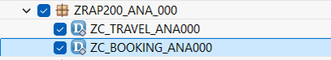
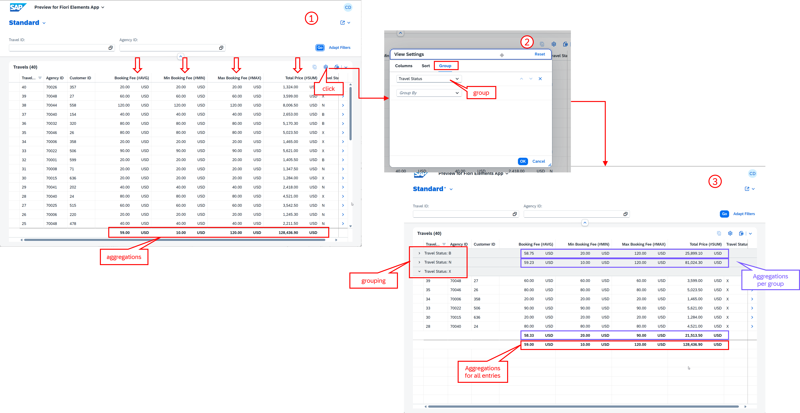
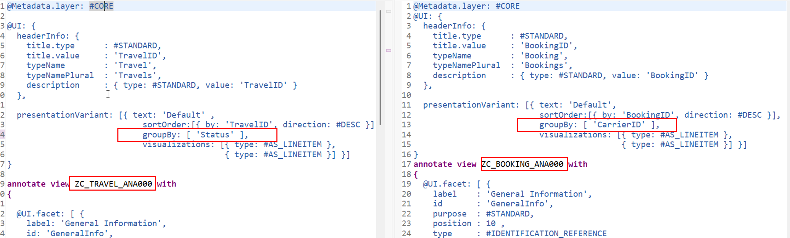

[Home - RAP200](../../README.md)

# Exercise 6: Developing Read-Only RAP Analytical Tables

## Introduction

In the previous exercise, you've worked with the Backgroung Processing Framework (bgPF) (_see [Exercise 5](../ex05/README.md)_) - or at least generated and published the _Travel_ processing app, as well as generated demo data (_see [Exercise 1](../ex01/README.md)_).

In this exercise, you will create a read-only _Travel_ app based on the read-only RAP Analytical Table. You will create a new sub-package, analytical CDS projection views, metadata extensions, a new service definition, and a service binding.

> ℹ️ **Info**: Editable RAP Analytical Tables are not yet supported. See the SAP Roadmap for more information.

### Exercises

- [6.1 - Create a New Package](#exercise-61-create-a-new-package)
- [6.2 - Create the Analytical Data Model Projections](#exercise-62-create-the-analytical-data-model-projections)
- [6.3 - Create the Metadata Extensions for Defining the UI semantics](#exercise-63-create-the-metadata-extensions-for-defining-the-ui-semantics)
- [6.4 - Create the Service Definition](#exercise-64-create-the-service-definition)
- [6.5 - Create and Publish the Service Binding](#exercise-65-create-and-publish-the-service-binding)
- [6.6 - Preview the Travel App](#exercise-66-preview-the-travel-app)
- [Summary](#summary)

<br/>

> [!TIP]
> <details>
>  <summary>Click to expand ADT tips!</summary>  
>  
> - Always replace all occurrences of the placeholder **`###`** in the provided code snippets with your personal suffix.
> - Use the ADT function _**Find and Replace All**_ (**Ctrl+F**) to quickly replace text in the source code.
> - Use the ADT function _**Quick Fix**_ (**Ctrl+1**), aka _Quick Assist_, on an erroneous element to get help with resolving the issue.
> - Use the **Show ABAP element info** view (**F2**) to inspect an element in ADT editors.
> - Use the **ABAP Formater** function (**Ctrl+F1**) to format your source code.
> - [Useful Keyboard Shortcuts for ABAP Development](https://help.sap.com/docs/ABAP_PLATFORM_NEW/c238d694b825421f940829321ffa326a/4ec299d16e391014adc9fffe4e204223.html?version=latest) (ADT shortcuts)
>
> </details>

> [!NOTE]
> **About RAP Analytical Tables**
> 
> <details>
>  <summary>Click to expand!</summary>  
> 
>  <br/>
>  
> The RAP Analytical Tables provide a type of data visualization on a SAP Fiori UI that contains a set of structured data and provides several possibilities for aggregating the data. It allows analytical evaluations in applications built with the ABAP RESTful Application Programming Model (RAP). The modeling is based on CDS views annotated with `@OData.applySupportedForAggregation: #FULL`.
> 
> **Only read-only RAP analytical tables** are supported at this time. SAP plans to support editable RAP analytical table in the future. This information reflects the current plans and may be changed by SAP without prior notice. Refere to te [ABAP Cloud Roadmap Information↗](https://help.sap.com/docs/abap-cross-product/roadmap-info/abap-cloud-roadmap-information) for updates.   
>  
> **Learn more:** [RAP Analytical Tables](https://help.sap.com/docs/abap-cloud/abap-rap/using-aggregate-data-in-sap-fiori-apps) | [Developing Read-only RAP Analytical Table](https://help.sap.com/docs/abap-cloud/abap-rap/developing-read-only-rap-analytical-tables)
>  </details>

---

## Exercise 6.1: Create a New Package
[^Top of page](#)

> Create a sub-package `ZRAP200_ANA_###` to group the analytical artefacts together.

<details>
  <summary>🔵 Click to expand!</summary>

1. Right-click on your exercise package **`ZRAP200_###`** and select **New** > **ABAP Package**.

2. Enter the following values:

   | Field | Value |
   |---|---|
   | Package Name | **`ZRAP200_ANA_###`** |
   | Description | **`RAP200: Read-only Travel RAP Analytical Table`** |
   | Superpackage | **`ZRAP200_###`** |

3. Click **Next >**, select a transport request if required and click **Next >**, then click **Finish** to confirm the creation.

<br/>

</details>

## Exercise 6.2: Create the Analytical Data Model Projections
[^Top of page](#)

> Create CDS projection views `ZC_TRAVEL_ANA###` and `ZC_BOOKING_ANA###` with analytical annotations for the Travel and Booking entities.

<details>
  <summary>🔵 Click to expand!</summary>

### Exercise 6.2.1: Create the Projection View for _Travel_ Entity

> Create the **root** projection view `ZC_TRAVEL_ANA###` with analytical annotations for the _Travel_ entity.
>  
> 💡Booster available to speed up the implementation.

<details>
  <summary>🟣 Click to expand!</summary>

1. Right-click on the package **`ZRAP200_ANA_###`** and select **New** > **Other ABAP Repository Object** > **Core Data Services** > **Data Definition**.

2. Enter the following values:

   | Field | Value |
   |---|---|
   | Name              | **`ZC_TRAVEL_ANA###`** |
   | Description       | **`Analytical Projection for Travel entity`** |
   | Referenced Object | **`ZR_TRAVEL###`** |   
   | Package           | **`ZRAP200_ANA_###`** |
        
3. Click **Next >** to continue, select a transport request if requested, click **Next >** to continue, select the template **`DefineProjectionView`** under **Projection View (creations)** in the tree, and confirm with **Finish**.

   > ---
   > 💡 **Booster:**
   > 
   > If you want to use this booster, please replace the entire source code of the data definition with the version provided in the document below
   > and then read the step-by-step instructions provided below to understand what has been done. Do not forget to replace all occurences of the
   > placeholder **`###`** with your personal suffix.
   >
   > 1. Replace the entire source code with the version provided here:
   >   
   >   ▶📄Source code document: [ex06_ddls_ZC_TRAVEL_ANA###.txt](sources/ex06_ddls_ZC_TRAVEL_ANA.txt)
   > 
   > 2. Save  (**Ctrl+S**). **Do not activate it yet.** You first need to create the view `ZC_BOOKING_ANA###` for the booking entity.
   > 
   > 3. Now, continue directly with **Exercise 6.2.2: Create the Projection View for Booking Entity**.
   > ---

   <br/>
   
4. Add key elements of the analytical _Travel_ projection view:

   - Specify the _Travel_ projection view as root entity by adding the keyword **`root`** after the keyword **`define`**   
     and add the provider contract **`transactional_query`** after the view name::

     ```abap
     define root view entity ZC_TRAVEL_ANA### 
     provider contract transactional_query
     as projection on ZR_TRAVEL###
     ```
     
   - Add the association **`_BaseEntity`** to the base _Travel_ view entity:

     ```abap
     association [1..1] to ZR_TRAVEL### as _BaseEntity on $projection.UUID = _BaseEntity.UUID
     ```

   - Expose **`_BaseEntity`** at the end of the select list.

   - Redirect the **`_Booking`** association to the new analytical Booking projection view  **`ZC_BOOKING_ANA###`**:

     ```abap
     _Booking : redirected to composition child ZC_BOOKING_ANA###,
     ```

5. Enable the RAP analytical table for the _Travel_ projection view.

   For that, add the view annotation **`@OData.applySupportedForAggregation`** in the header section , before the keyword **`define...`**, to enable the RAP analytical table:

     ```abap
     @OData.applySupportedForAggregation: #FULL
     ```
   
  6. Add the element annotation **`@Aggregation.default** to define aggregated values:

     > ℹ️**Info**:  
     > 
     > | Annotation | Purpose |
     > |---|---|
     > | `@Aggregation.default: #AVG` | Show the average value |
     > | `@Aggregation.default: #MAX` | Show the maximum value |
     > | `@Aggregation.default: #MIN` | Show the minimum value |
     > | `@Aggregation.default: #SUM` | Show the sum of all values |

     - Add the annotation **`@Aggregation.default: #AVG`** to the **`BookingFee`** field to define the booking fee average and specify **`Booking Fee (#AVG)`** as the new column label:

       ```abap
       @Aggregation.default: #AVG
       @EndUserText.label: 'Booking Fee (#AVG)'
       @Semantics.amount.currencyCode: 'CurrencyCode'
       BookingFee,      
       ```

     - Add the **new** fields **`MinBookingFee`** to display the minimum booking fee (#MIN) and **`MaxBookingFee`** to display the maximum booking fee (#MAX) to the list:
         
       ```abap
       @Aggregation.default: #MIN
       @EndUserText.label: 'Min Booking Fee (#MIN)'
       @Semantics.amount.currencyCode: 'CurrencyCode' 
       BookingFee as MinBookingFee,
       
       @Aggregation.default: #MAX
       @EndUserText.label: 'Max Booking Fee (#MAX)'
       @Semantics.amount.currencyCode: 'CurrencyCode'
       BookingFee as MaxBookingFee,  
       ```

     -  Add the element annotation **`@Aggregation.default: #SUM`** to the **`TotalPrice`** field to define the summ of all total prices and specify **`Total Price (#SUM)`** as the new column label:

        ```abap
        @Aggregation.default: #SUM
        @EndUserText.label: 'Total Price (#SUM)'
        @Semantics.amount.currencyCode: 'CurrencyCode'
        TotalPrice,         
        ```         
<!-- 
7. Replace the complete source code with the one provided below, and replace all placeholder `###` with your chosen suffix.

   <details>
     <summary>🟣📄Click to expand the source code of ZC_TRAVEL_ANA###!</summary>  
     
   <br/>
   
   > 💡 Replace all occurences of the placeolder `###` with your personal suffix.
     
   ```abap
   @Metadata.allowExtensions: true
   @AccessControl.authorizationCheck: #CHECK
   @EndUserText.label: 'Proj. view for Travel Analytical Table'
   @Metadata.ignorePropagatedAnnotations: true
   @OData.applySupportedForAggregation: #FULL
    
   define root view entity ZC_TRAVEL_ANA### 
   provider contract transactional_query
   as projection on ZR_TRAVEL###
     association [1..1] to ZR_TRAVEL### as _BaseEntity on $projection.UUID = _BaseEntity.UUID
   {
       key UUID,
         TravelID,
         AgencyID,
         CustomerID,
         BeginDate,
         EndDate,
         
         @Aggregation.default: #AVG
         @EndUserText.label: 'Booking Fee (#AVG)'
         @Semantics.amount.currencyCode: 'CurrencyCode'
         BookingFee,
         
         @Aggregation.default: #MIN
         @EndUserText.label: 'Min Booking Fee (#MIN)'
         @Semantics.amount.currencyCode: 'CurrencyCode' 
         BookingFee as MinBookingFee,
          
         @Aggregation.default: #MAX
         @EndUserText.label: 'Max Booking Fee (#MAX)'
         @Semantics.amount.currencyCode: 'CurrencyCode'
         BookingFee as MaxBookingFee,
          
         @Aggregation.default: #SUM
         @EndUserText.label: 'Total Price (#SUM)'
         @Semantics.amount.currencyCode: 'CurrencyCode'
         TotalPrice,
          
         @Consumption: { valueHelpDefinition: [{ entity.element: 'Currency', entity.name: 'I_CurrencyStdVH',useForValidation: true }] }
         CurrencyCode,
         Description,
         Notification,
         Status,
          
         /* public associations*/      
         _Booking : redirected to composition child ZC_BOOKING_ANA###,
         _BaseEntity      
   }
   ```   
   </details>

--> 

7. Save  (**Ctrl+S**). **Do not activate yet.**

</details>
  
### Exercise 6.2.2: Create the Projection View for _Booking_ Entity 

> Create the CDS projection view `ZC_BOOKING_ANA###` with analytical annotations for the _Booking_ entity.
>  
> 💡Booster available to speed up the implementation.

<details>
  <summary>🟣 Click to expand!</summary>
  
1. Create a new CDS projection view **`ZR_BOOKING_###`** in your exercise package **`ZRAP200_ANA_###`** with the following values:
  
   | Field | Value |
   |---|---|
   | Name              | **`ZC_BOOKING_ANA###`** |
   | Description       | **`Analytical Projection for Booking entity`** |
   | Referenced Object | **`ZR_BOOKING###`** |   
   | Package           | **`ZRAP200_ANA_###`** |- 

2. Click **Next >** to continue, select a transport request if requested, click **Next >** to continue, select the template **`DefineProjectionView`** under **Projection View (creations)** in the tree, and confirm with **Finish**.

   > ---
   > 💡 **Booster:**
   > 
   > If you want to use this booster, please replace the entire source code of the data definition with the version provided in the document below
   > and then read the step-by-step instructions provided below to understand what has been done. Do not forget to replace all occurences of the
   > placeholder **`###`** with your personal suffix.
   > 
   > 1. Replace the entire source code with the version provided here:
   >   
   >    ▶📄Source code document: [ex06_ddls_ZC_BOOKING_ANA###.txt](sources/ex06_ddls_ZC_BOOKING_ANA.txt)
   >   
   > 2. Now, save  the changes and activate both projection views together at the same time by pressing **Ctrl+Shift+F3**.
   >  
   >        
   > 
   > 4. Now, continue directly with [**Exercise 6.3: Create the Metadata Extensions**](#exercise-63-create-the-metadata-extensions).
   > ---   

   <br/>
   
3. Add key elements of the analytical _Booking_ projection view:

   <!-- > ℹ️ Note that the complete source code of `ZC_BOOKING_ANA###` is provided below. -->

   - Add the association **`_BaseEntity`** to the base _Booking_ view entity:

     ```abap
     association [1..1] to ZR_BOOKING### as _BaseEntity on $projection.UUID = _BaseEntity.UUID
     ```

   - Expose **`_BaseEntity`** at the end of the select list.

   - Redirect the **`_Travel`** association to the new analytical Travel projection view **`ZC_TRAVEL_ANA###`**:

     ```abap
     _Booking : redirected to composition child ZC_BOOKING_ANA###,

4. Enable the RAP analytical table for the _Booking_ projection view:

   - Add the view annotation **`@OData.applySupportedForAggregation`** in the header section , before the keyword **`define...`**, to enable the RAP analytical table:

     ```abap
     @OData.applySupportedForAggregation: #FULL
     ```

     - Add the annotation **`@Aggregation.default: #SUM`** to the **`FlightPrice`** field to computation of the sum of all flight prices and specify **`Flight Price (#SUM)`** as the new column label:

       ```abap
       @Aggregation.default: #SUM
       @EndUserText.label: 'Flight Price (#SUM)'
       @Semantics: { amount.currencyCode: 'CurrencyCode' }
       FlightPrice,     
       ```

       - Add the **new** fields **`AvgFlightPrice`** to display the average of the flight prices (#AVG) and **`MinFlightPrice`** to display the minimum flight price (#MIN) to the `select` list:
         
         ```abap
         @Aggregation.default: #AVG
         @EndUserText.label: 'Flight Price (#AVG)'
         @Semantics: { amount.currencyCode: 'CurrencyCode' }
         FlightPrice as AvgFlightPrice, 
              
         @Aggregation.default: #MIN
         @EndUserText.label: 'Flight Price (#MIN)'
         @Semantics: { amount.currencyCode: 'CurrencyCode' } 
         FlightPrice as MinFlightPrice,     
         ```      
<!--
5. Replace the complete source code with the one provided below, and replace all placeholder `###` with your chosen suffix.

   <details>
     <summary>💡📄Click to expand the source code of ZC_TRAVEL_ANA###!</summary>  
     
   <br/>
        
   ```abap
   @Metadata.allowExtensions: true
   @Metadata.ignorePropagatedAnnotations: true
   @EndUserText: { label: 'Proj view for Booking Analytical Table' }
   @ObjectModel.semanticKey: [ 'BookingID' ]
   @AccessControl.authorizationCheck: #CHECK
   @OData.applySupportedForAggregation: #FULL
    
   define view entity ZC_BOOKING_ANA###
     as projection on ZR_BOOKING###
     association [1..1] to ZR_BOOKING### as _BaseEntity on $projection.UUID = _BaseEntity.UUID
   {
     key UUID,
         ParentUUID,
         BookingID,
         BookingDate,
         CustomerID,
         CarrierID,
         ConnectionID,
         FlightDate,
         
         @Aggregation.default: #SUM
         @EndUserText.label: 'Flight Price (#SUM)'
         @Semantics: { amount.currencyCode: 'CurrencyCode' }
         FlightPrice, 
    
         @Aggregation.default: #AVG
         @EndUserText.label: 'Flight Price (#AVG)'
         @Semantics: { amount.currencyCode: 'CurrencyCode' }
         FlightPrice as AvgFlightPrice, 
                
         @Aggregation.default: #MIN
         @EndUserText.label: 'Flight Price (#MIN)'
         @Semantics: { amount.currencyCode: 'CurrencyCode' } 
         FlightPrice as MinFlightPrice,         
          
         @Consumption: { valueHelpDefinition: [{ entity.element: 'Currency', entity.name: 'I_CurrencyStdVH',useForValidation: true }] }      
         CurrencyCode,
          
         /* public associations*/
         _Travel : redirected to parent ZC_TRAVEL_ANA###,
         _BaseEntity
   }
   ```

   </details>
-->

5. Now, save  the changes and activate both projection views together at the same time by pressing **Ctrl+F9**.

<br/>

</details>

</details>

## Exercise 6.3: Create the Metadata Extensions for Defining the UI semantics
[^Top of page](#)

> Define the UI semantics for the analytical projections by creating the CDS metadata extensions `ZC_TRAVEL_ANA###` and `ZC_BOOKING_ANA###` for the _Travel_ and _Booking_ projection views respectively.

<details>
  <summary>🔵 Click to expand!</summary>

1. Create the metadata extension **`ZC_TRAVEL_ANA###`** for the projection view **`ZC_TRAVEL_ANA###`** in your exercise package **`ZRAP200_ANA_###`**.

2. Enter following values:

   | Field | Value|
   |---|---|
   | Name             | **`ZC_TRAVEL_ANA###`** |
   | Description      | **`Metadata Extension for ZC_TRAVEL_ANA###`** |
   | Extended Entity  | **`ZC_TRAVEL_ANA###`** |   
   | Package          | **`ZRAP200_ANA_###`** |  

3. Replace the entire source code of each metadata extension with the appropriate new version provided below, and replace all occurrences of the placeholder **`###`** with your personal suffix.

   <!--
   > 💡Hint: Open the 📄source code document in a separate window and use of the _Copy Raw Content_ function () to copy the provided source code.
   -->

   ▶📄**Source Code document:** [**ex06_ddlx_ZC_TRAVEL_ANA###.txt**](sources/ex06_ddlx_ZC_TRAVEL_ANA.txt)      
   
4. Save  (**Ctrl+S**) and activate  (**Ctrl+F3**) the changes.

5. Now, create the metadata extension **`ZC_BOOKING_ANA###`** for the projection view **`ZC_BOOKING_ANA###`** in your exercise package **`ZRAP200_ANA_###`**.

6. Enter following values:

   | Field | Value  | 
   |---|---|
   | Name             | **`ZC_BOOKING_ANA###`** |
   | Description      | **`Metadata Extension for ZC_BOOKING_ANA###`** |
   | Extended Entity  | **`ZC_BOOKING_ANA###`**  |   
   | Package          | **`ZRAP200_ANA_###`** |  

7. Replace the entire source code of each metadata extension with the appropriate new version provided below and replace all occurrences of the placeholder **`###`** with your personal suffix.

   ▶📄**Source Code document:** [**ex06_ddlx_ZC_BOOKING_ANA###.txt**](sources/ex06_ddlx_ZC_BOOKING_ANA.txt)
   
8. Save  (**Ctrl+S**) and activate  (**Ctrl+F3**) the changes.

<br/>

</details>


## Exercise 6.4: Create the Service Definition
[^Top of page](#)

> Create the service definition `ZUI_TRAVEL_ANA_O4###` to expose the analytical projections.

<details>
  <summary>🔵 Click to expand!</summary>

1. Right-click on the CDS projection view **`ZC_TRAVEL_ANA###`** and select **New Service Definition** from the context menu.

2. Enter the following values:

   | Field | Value |
   |---|---|
   | Name | **`ZUI_TRAVEL_ANA_O4###`** |
   | Description | **`Service Definition for ZC_TRAVEL_ANA###`** |
   | Referenced Object | **`ZC_TRAVEL_ANA###`**  |   
   | Package            | **`ZRAP200_ANA_###`** |     

3. Perform followings adjustments:

   - Specify **`ZC_TRAVEL_ANA###`** as the lead entity in the header section using the view annotation **`@ObjectModel.leadingEntity.name`**:

     ```abap
     @ObjectModel.leadingEntity.name: 'ZC_TRAVEL_ANA###'  
     ```     
     
   - Add **`Travel`** as alias for the analytical _Travel_ projection view **`ZC_TRAVEL_ANA###`**:

     ```abap
     expose ZC_TRAVEL_ANA### as Travel;
     ```
     
   - Also expose the analytical _Booking_ projection view **`ZC_BOOKING_ANA###`** with the alias **`Booking`**:

     ```abap
     expose ZC_BOOKING_ANA### as Booking;
     ```

4. ℹ️The entire source code should look as follows:
  
   ```abap
   @EndUserText.label: 'Service Definition for ZC_TRAVEL_ANA###'
   @ObjectModel.leadingEntity.name: 'ZC_TRAVEL_ANA###' 
   define service ZUI_TRAVEL_ANA_O4###
     provider contracts odata_v4_ui {
     expose ZC_TRAVEL_ANA###  as Travel;
     expose ZC_BOOKING_ANA### as Booking;
   }
   ```       

5. Save  (**Ctrl+S**) and activate  (**Ctrl+F3**) the changes.

</details>

## Exercise 6.5: Create and Publish the Service Binding
[^Top of page](#)

> Create the service binding `ZUI_TRAVEL_ANA_O4###`, publish it, and preview the analytical Travel app.

<details>
  <summary>🔵 Click to expand!</summary>

1. Right-click on the service definition **`ZUI_TRAVEL_ANA_O4###`** and select **New Service Binding** from the context menu.

2. Enter the following values:

   | Field | Value |
   |---|---|
   | Name               | **`ZUI_TRAVEL_ANA_O4###`** |
   | Description        | **`Service Binding for ZC_TRAVEL_ANA###`** |
   | Binding Type       | **`OData V4 - UI`** |
   | Service Definition | **`ZUI_TRAVEL_ANA_O4###`**  |   
   | Package            | `ZRAP200_ANA_###` |        

4. Click **Next**, select a transport request, and confirm the dialog to create the new service binding.

5. Save  (**Ctrl+S**) and activate  (**Ctrl+F3**) the new service binding.

6. Click the **Publish** button to publish the local service endpoint.

   <!--    -->

</details>

## Exercise 6.6: Preview the _Travel_ App
[^Top of page](#)

> Preview the _Travel_ app and play around.

<details>
  <summary>🔵 Click to expand!</summary>

1. Go to the **Service Binding**, select the **Travel** entity (leading entity) and start the **SAP Fiori Elements App Preview**.

2. Press **Go** to load the data in the app.

3. Verify that:
   - The analytical table displays Travel data with aggregated values.
   - You can group, filter, and sort the data in the analytical table via , the **Settings** icon:
     - Group the _travel_ records by the travel status field **`Status`** --> **Group By Travel Status**
     - Group the _booking_ records by the carrier ID field **`CarrierId`** --> **Group By `Airline ID`** 
        
   <br/>
   
       

<br/>

4. 💡**Hints**: You can define the grouping in the backend by...  
    - Adding or uncommenting the line **`groupBy: [ 'Status' ],`** in the header section of the metadata extension **`ZC_TRAVEL_ANA###`** to define the default grouping fof the _Travel_ data in the _travel_ list report table.
    - Adding or uncommenting the line **`groupBy: [ 'CarrierID' ],`** in the header section of the metadata extension **`ZC_BOOKING_ANA###`** to define the default grouping of the _Booking_ data in the _booking_ table on the object page.
      
    <br/>
   
        

</details>


## Summary
[^Top of page](#)

Congratulations! 🎉 You have successfully completed all exercises of the RAP200 workshop.

You've...
- created a sub-package for analytical artefacts,
- created analytical CDS projection views for Travel and Booking with aggregation annotations,
- defined metadata extensions for the analytical UI layout,
- created a service definition and service binding, and
- published and previewed the read-only RAP analytical table.

Throughout this workshop, you have built a complete Travel Processing application using RAP, covering:
- ✅ Transactional UI service generation with the RAP Generator
- ✅ Business logic with determinations, actions, and feature control
- ✅ Collaborative draft handling
- ✅ Event-driven side effects
- ✅ Read-only RAP Analytical Tables

▶ Return to **[Home - RAP200](../../README.md)**

---
